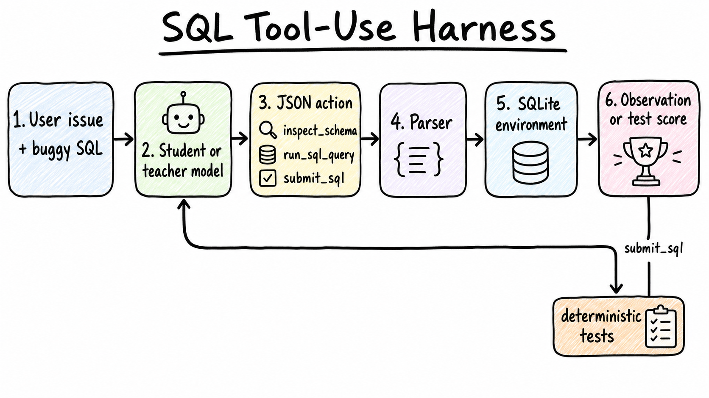
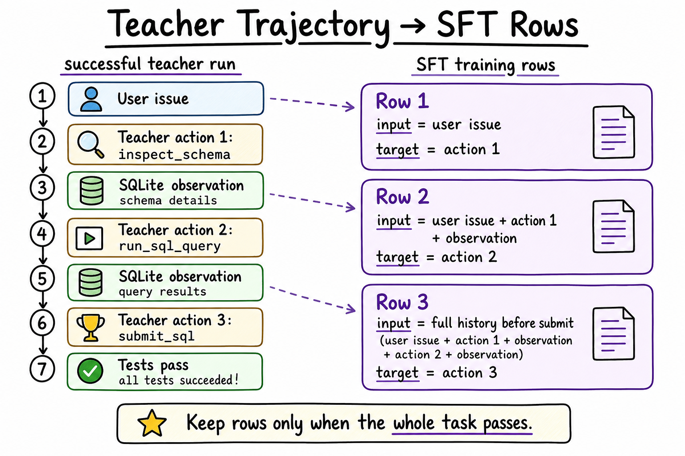
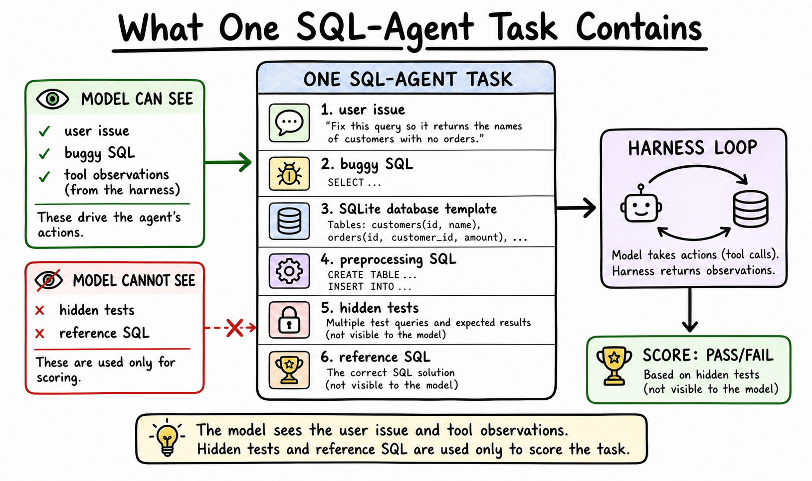
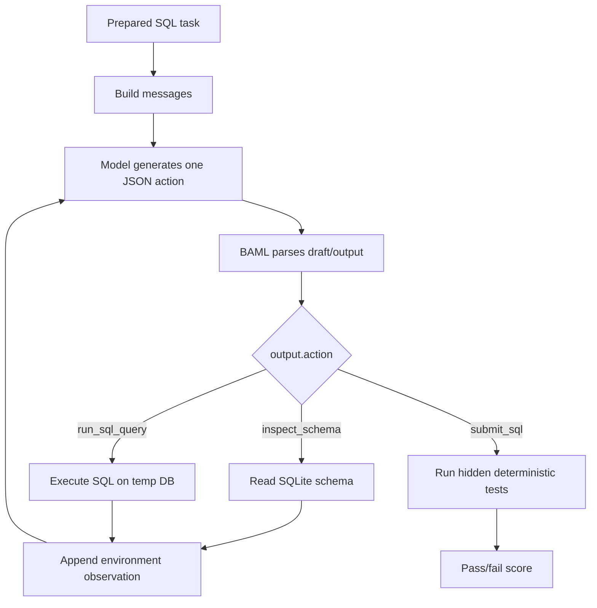

# Distilling A 0.8B SQL Tool-Use Agent

This post is about a very practical question:

> Can we take a tiny model, put it inside a real tool-use harness, and teach it to behave more like a stronger model on one focused task?

That is the version of distillation I care about here. Not just "make the small language model imitate text from the big language model", but "make the small model imitate useful behavior inside the same environment where it will actually run."

For this first post, the environment is SQLite. The model gets a user issue and a buggy SQL query. It can inspect the schema, run SQL, observe results or errors, and finally submit corrected SQL. The score is deterministic: hidden tests run against the database. No LLM user simulator. No LLM judge.



## The Plan

We will build the post around one loop:

1. Prepare a focused SQL-agent benchmark.
2. Run a small baseline student.
3. Run stronger teacher baselines.
4. Keep only successful teacher trajectories.
5. Convert each successful trajectory into supervised fine-tuning rows.
6. Train the 0.8B student with hard-token SFT.
7. Re-run the same eval and compare.

The important constraint is fairness: the baseline student, teachers, trajectory collection, training data, and tuned-student eval all use the same structured harness contract.

## What Distillation Means Here

In ordinary supervised fine-tuning, we train on input/output examples:

```text
prompt -> desired answer
```

For an agentic harness, the examples are not just final answers. They are next actions:

```text
conversation so far -> next tool action
```

If the teacher solves a task in three actions, we can produce three training rows:

```text
user issue -> teacher action 1
user issue + action 1 + observation -> teacher action 2
full history before submit -> teacher action 3
```

This is offline hard-token distillation. "Offline" because we generate teacher trajectories first and train later. "Hard-token" because the target is the teacher's actual next tokens, not the full probability distribution over possible tokens. Later posts can use logits/probabilities, on-policy corrections, and RL-style rewards.



## The Benchmark

For the current version of Blog 1, we use [`birdsql/six-gym-sqlite`](https://huggingface.co/datasets/birdsql/six-gym-sqlite).

Each row contains:

- a natural-language user issue
- buggy or incomplete SQL
- a SQLite database template
- optional preprocessing SQL
- hidden test cases
- reference SQL

The model does **not** see the hidden tests or reference SQL. Those are only for scoring.



The prepared split is deterministic:

```text
data/sql_agent_bird_critic/train.jsonl  # written by Notebook 01
data/sql_agent_bird_critic/eval.jsonl   # written by Notebook 01
data/sql_agent_bird_critic/dbs/         # SQLite templates
```

The split is created in the first notebook, not in a hidden preparation script:

```text
1-distilling-a-0-8b-tool-calling-agent/notebooks/01_explore_sql_agent_benchmark.ipynb
```

The split variables are visible in the notebook:

```python
SPLIT_SEED = 42
EVAL_FRACTION = 0.2
TASK_CATEGORY = "Query"
DB_FILTER = ["netflix", "movie_3", "books", "chinook"]
```

The selected split is domain-focused: only `Query` tasks from the selected media/catalog-style databases. We split by percentage inside each database, so eval stays representative of the same domain mix.

```text
netflix
movie_3
books
chinook
```

## The Harness

The model has one action interface:

```json
{"action": "inspect_schema"}
{"action": "run_sql_query", "sql": "SELECT ..."}
{"action": "submit_sql", "sql": ["SQL statement 1", "SQL statement 2"]}
```

The harness runs one action at a time. If the model inspects the schema or runs SQL, the environment appends an observation and asks for the next action. If the model submits SQL, the harness runs the hidden tests and stops.



The core loop is small. The real version lives in `common/sql_agent.py`, but conceptually it is this:

```python
def run_task(row, *, data_dir, generate, max_turns=8):
    messages = initial_messages(row)

    with task_database(row, data_dir) as db_path:
        conn = sqlite3.connect(db_path)
        execute_sql_list(conn, row["preprocess_sql"])

        for turn in range(1, max_turns + 1):
            baml_output = generate(messages)
            draft, action = parse_decision(baml_output)

            if action is None:
                return task_result(row, trace, "parse_failure", False)

            messages.append({"role": "assistant", "content": baml_output})

            if action["action"] == "inspect_schema":
                observation = schema_text(conn)
                messages.append({"role": "user", "content": environment_message(observation)})
                continue

            if action["action"] == "run_sql_query":
                observation = run_sql_observation(conn, action["sql"])
                messages.append({"role": "user", "content": environment_message(json.dumps(observation))})
                continue

            score = evaluate_submitted_sql(row, action["sql"], data_dir)
            return task_result(row, trace, "submitted", score["success"])

        return task_result(row, trace, "max_turns", False)
```

The parser is structural: it expects BAML-style `draft` plus `output`, then validates the action name and argument types. It does not use user-word keyword matching.

```python
def parse_decision(text):
    stripped = strip_model_text(text)
    value = json.loads(stripped)
    draft = value.get("draft")
    output = value.get("output", value)
    return draft, normalize_action(output)
```

## A Real Task

Here is one held-out eval task:

```text
Task id: TRAIN_1155
Database: hockey
Category: Query

User issue:
In the hockey database, we have a table `abbrev` storing abbreviation
types, codes, and their full names. We need to retrieve the Type, Code,
and Fullname for each entry. An initial attempt might involve incorrect
data type handling or referencing columns incorrectly.

Buggy SQL:
SELECT CAST(Type AS INTEGER) AS TypeId, Code, Fullname FROM abbrev

Reference SQL, hidden from model:
SELECT Type, Code, Fullname FROM abbrev
```

The base student starts in the right direction but does not follow the action contract reliably:

```text
Turn 1 parsed action:
{"action": "inspect_schema"}

Environment:
schema text, including table abbrev(Type, Code, Fullname)

Turn 2 BAML-canonical output:
The user wants me to fix a SQL query that retrieves abbreviations...

Parsed action:
None

Stop reason:
parse_failure
```

The GPT teacher solves it:

```text
Turn 1:
{"action":"inspect_schema"}

Turn 2:
{"action":"run_sql_query","sql":"SELECT Type, Code, Fullname FROM abbrev LIMIT 5"}

Environment:
[["Team", "MTL", "Montreal Canadiens"],
 ["Team", "TOR", "Toronto Maple Leafs"],
 ["League", "NHL", "National Hockey League"]]

Turn 3:
{"action":"submit_sql","sql":["SELECT Type, Code, Fullname FROM abbrev"]}

Score:
pass
```

The first tuned student also solves this specific task:

```text
Turn 1 parsed action:
{"action": "inspect_schema"}

Turn 2 parsed action:
{"action": "run_sql_query", "sql": "SELECT Type, Code, Fullname FROM abbrev"}

Turn 3 parsed action:
{"action": "submit_sql", "sql": ["SELECT Type, Code, Fullname FROM abbrev"]}

Score:
pass
```

This is what we want distillation to do: make the small model produce useful next actions in the harness. But one nice example is not enough. The aggregate score decides.

## Baseline Evals

Base student:

```bash
uv run mlx_lm.server \
  --model mlx-community/Qwen3.5-0.8B-MLX-bf16 \
  --host 127.0.0.1 \
  --port 8091 \
  --chat-template-args '{"enable_thinking": false}'
```

```bash
uv run python 1-distilling-a-0-8b-tool-calling-agent/eval_sql_agent.py \
  --model mlx-community/Qwen3.5-0.8B-MLX-bf16 \
  --base-url http://127.0.0.1:8091/v1 \
  --data-dir data/sql_agent_bird_critic \
  --max-turns 8 \
  --max-new-tokens 1024 \
  --output outputs/qwen3_5_0_8b_mlx_sql_agent_eval_100.json
```

GPT teacher:

```bash
uv run python 1-distilling-a-0-8b-tool-calling-agent/eval_sql_agent.py \
  --model gpt-5.5 \
  --base-url http://127.0.0.1:8080/v1 \
  --reasoning-effort medium \
  --data-dir data/sql_agent_bird_critic \
  --max-turns 8 \
  --max-new-tokens 2048 \
  --output outputs/gpt_5_5_medium_sql_agent_eval_100.json
```

Qwen teacher:

```bash
uv run mlx_lm.server \
  --model mlx-community/Qwen3.5-35B-A3B-8bit \
  --host 127.0.0.1 \
  --port 8092 \
  --chat-template-args '{"enable_thinking": false}'
```

```bash
uv run python 1-distilling-a-0-8b-tool-calling-agent/eval_sql_agent.py \
  --model mlx-community/Qwen3.5-35B-A3B-8bit \
  --base-url http://127.0.0.1:8092/v1 \
  --data-dir data/sql_agent_bird_critic \
  --max-turns 8 \
  --max-new-tokens 2048 \
  --output outputs/qwen3_5_35b_a3b_8bit_mlx_server_sql_agent_eval_100.json
```

Current BAML-harness held-out results:

| Run | Success | Submitted | Parse Failures | Max-Turn Failures |
| --- | ---: | ---: | ---: | ---: |
| Qwen3.5-0.8B base student | rerun | rerun | rerun | rerun |
| LFM2.5-8B-A1B MLX 8-bit baseline | rerun | rerun | rerun | rerun |
| Qwen3.5-35B-A3B 8-bit teacher | rerun | rerun | rerun | rerun |
| GPT 5.5 medium teacher | rerun | rerun | rerun | rerun |

This table should only contain results from the current BAML structured-output harness.

The current harness uses BAML for OpenAI-compatible model calls. The model returns one structured decision:

```json
{
  "draft": "Need schema before final SQL.",
  "output": {"action": "inspect_schema"}
}
```

## Generating Teacher Data

For teacher data, we run the teacher on train tasks and keep only successful trajectories:

```bash
uv run python 1-distilling-a-0-8b-tool-calling-agent/generate_sql_teacher_sft_rows.py \
  --model gpt-5.5 \
  --base-url http://127.0.0.1:8080/v1 \
  --reasoning-effort medium \
  --data-dir data/sql_agent_bird_critic \
  --partition train \
  --max-turns 8 \
  --max-new-tokens 2048 \
  --task-timeout-seconds 180 \
  --output outputs/gpt_5_5_medium_sql_agent_train_baml_sft_trace_rows.jsonl
```

Previous completed GPT teacher generation, before the percentage-based domain split:

```text
completed train tasks: 500/500
successful trajectories: 242/500
BAML-canonical SFT trace rows: 767
canonical rows <= 3072 tokens: 737
canonical rows <= 4096 tokens: 754
```

The teacher script writes BAML-canonical SFT trace rows from successful trajectories. The second notebook then turns those BAML-canonical SFT trace rows into the final SFT file:

```text
1-distilling-a-0-8b-tool-calling-agent/notebooks/02_explore_teacher_sft_data.ipynb
```

That notebook canonicalizes each assistant target:

```python
target = json.dumps(row["teacher_action"], separators=(",", ":"), ensure_ascii=False)
canonical_messages = row["messages"][:-1] + [{"role": "assistant", "content": target}]
```

The important detail is that we only keep rows from trajectories that fully pass the hidden tests. A beautiful-looking intermediate tool call from a failed task is not trusted. The final training target is the canonical next action, not the teacher's non-canonical text, because the harness consumes exactly one JSON action per turn.

## Training

The recommended NVIDIA training path uses Unsloth bf16 LoRA. The same defaults are used by MLX and TRL where the backend supports them:

```text
max_seq_length: 3072
batch_size: 1
gradient_accumulation_steps: 8
learning_rate: 1e-5
lora_rank: 16
lora_alpha: 16
```

For a rented RTX 4080 16GB server:

```bash
uv pip install unsloth

uv run python 1-distilling-a-0-8b-tool-calling-agent/train_unsloth.py \
  --model unsloth/Qwen3.5-0.8B \
  --train-path outputs/gpt_5_5_medium_sql_agent_train_sft_canonical_3072.jsonl \
  --output-dir outputs/qwen3_5_0_8b_unsloth_sql_agent_gpt_teacher_sft_3072
```

For Apple/MLX:

Direct MLX inference uses the no-thinking Qwen chat template. MLX-LM LoRA does not expose that same chat-template flag in its trainer, so I treat MLX training as an Apple experiment path and use Unsloth/TRL when I need exact no-thinking SFT parity.

```bash
uv run python 1-distilling-a-0-8b-tool-calling-agent/train_mlx.py \
  --model mlx-community/Qwen3.5-0.8B-MLX-bf16 \
  --train-path outputs/gpt_5_5_medium_sql_agent_train_sft_canonical_3072.jsonl \
  --output-dir outputs/qwen3_5_0_8b_mlx_sql_agent_gpt_teacher_sft_3072
```

In code, the training script calls MLX-LM directly. It does not shell out to a command string:

```python
from mlx_lm import lora

lora_args = dict(lora.CONFIG_DEFAULTS)
lora_args.update(
    train=True,
    model=args.model,
    data=str(mlx_data_dir),
    adapter_path=str(adapter_dir),
    iters=iters,
    batch_size=args.batch_size,
    grad_accumulation_steps=args.grad_accum,
    learning_rate=args.learning_rate,
    num_layers=args.num_layers,
    max_seq_length=args.max_seq_length,
    lora_parameters={"rank": args.lora_rank, "dropout": 0.0, "scale": args.lora_alpha},
    mask_prompt=True,
    grad_checkpoint=True,
)

lora.run(types.SimpleNamespace(**lora_args))
```

The earlier partial MLX run trained successfully but did not improve the model:

```text
BAML-canonical SFT trace rows: 148
rows <= 4096 tokens: 141
train rows: 134
validation rows: 7
final train loss: 0.139
final validation loss: 0.122
peak memory: 114.820 GB
```

That was useful as a failure, not as the final recipe. The next run uses the full teacher dataset, canonical one-action labels, and a shorter 3072-token default that is more realistic on a 16GB NVIDIA GPU.

## Tuned Student Eval

The tuned model should be evaluated through the same BAML harness. Serve the adapter through an OpenAI-compatible endpoint, then run:

```bash
uv run python 1-distilling-a-0-8b-tool-calling-agent/eval_sql_agent.py \
  --model qwen3_5_0_8b_sql_agent \
  --base-url http://127.0.0.1:8094/v1 \
  --data-dir data/sql_agent_bird_critic \
  --max-turns 8 \
  --max-new-tokens 1024 \
  --output outputs/qwen3_5_0_8b_unsloth_sql_agent_gpt_teacher_sft_3072_eval_100.json
```

Result:

| Run | Success | Submitted | Parse Failures | Max-Turn Failures |
| --- | ---: | ---: | ---: | ---: |
| Base student | rerun | rerun | rerun | rerun |
| Tuned student | rerun | rerun | rerun | rerun |

If the tuned model does not improve, the likely reasons to inspect are:

- too few successful teacher trajectories
- too many long rows filtered out by the sequence-length limit
- weak format learning despite the structured harness
- SQL task diversity that is still too broad for the small student
- a conservative LoRA recipe that underfits

## What We Learned

The pipeline is now real:

```text
teacher -> harness -> passing trajectories -> SFT rows -> LoRA -> same eval
```

The result should be interpreted only after rerunning every model through the same BAML harness.

For the next iteration of Blog 1, the highest-leverage fixes are:

1. Run the `737`-row canonical 3072-token SFT file through the recommended Unsloth recipe.
2. Add a small format-only warmup set so the student learns to emit one JSON action per turn.
3. Compare Unsloth and TRL on the same config.
4. Try a stronger or slightly larger student if the 0.8B model keeps failing the action protocol.

## Where The Series Goes Next

This post is hard-token offline distillation. The next posts can keep the same harness and change the learning signal:

- **Blog 2:** soft-label/logit distillation on teacher actions
- **Blog 3:** on-policy distillation from student rollouts and teacher corrections
- **Blog 4:** RL/GRPO-style training with SQLite test success as reward

The harness stays central. The model is only one part of the system.
