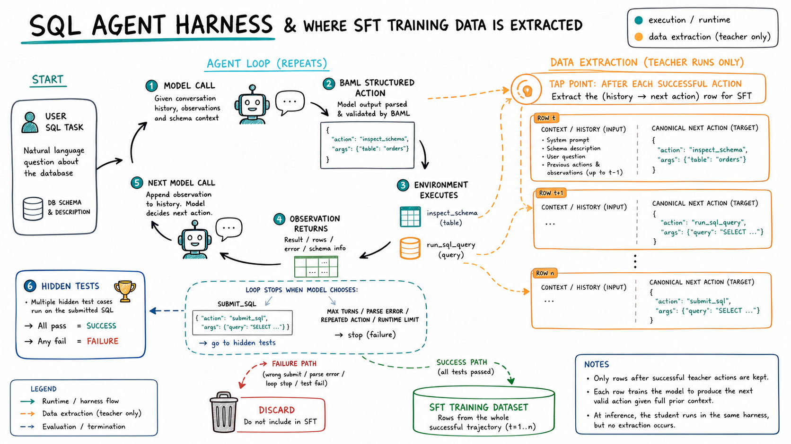
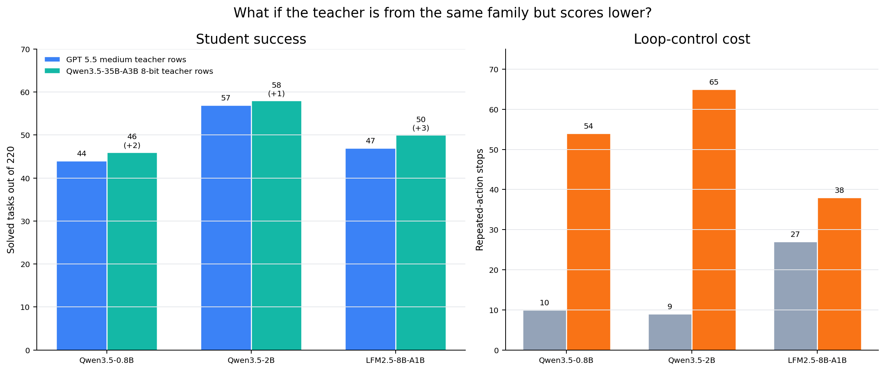
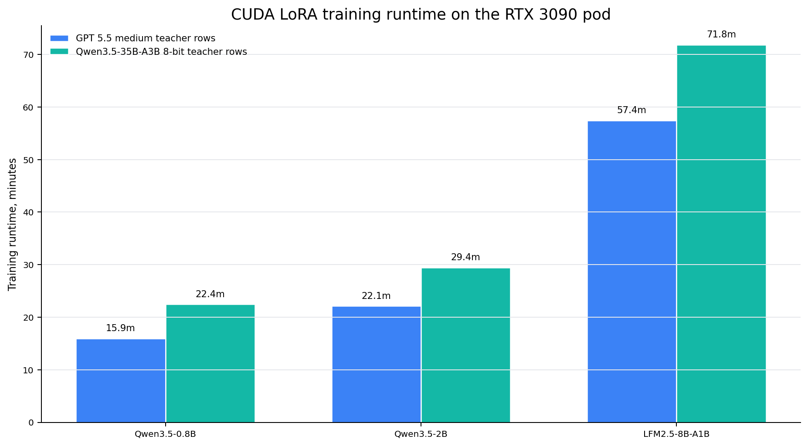
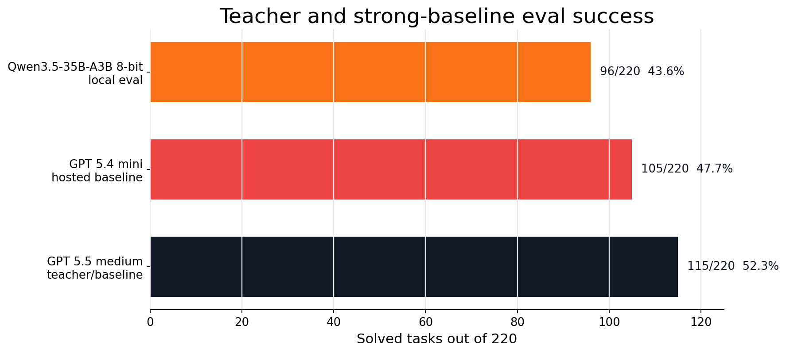
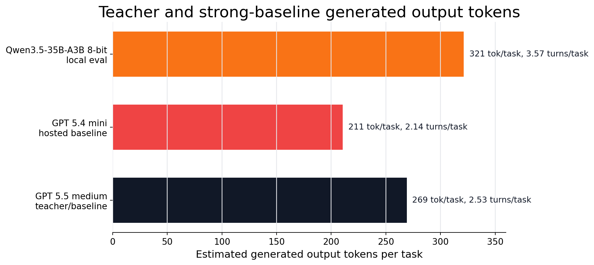

# Distilling A 0.8B SQL Tool-Use Agent

This series is my attempt to explore how far we can push small language models when we train them with the right signals, harnesses, and feedback loops. I want to try different practical techniques for getting more capability out of smaller models, especially in agentic settings where the model has to act, use tools, recover from observations, and produce something that can be scored. I am starting with the simplest useful version: off-policy hard-token distillation, where a stronger teacher runs the task first, I keep its successful trajectories, and then I fine-tune a smaller student to imitate the teacher’s next actions.

I started this experiment with a very specific question:

> Can a tiny model learn to act like a stronger model inside a real tool-use loop?

Not "can it write SQL-looking text?" Not "can it pass a prompt demo?" I wanted the small model to sit inside the same harness as the teacher, inspect a database, run SQL, read observations, and submit a final answer that passes deterministic hidden tests.

That distinction is the whole post.

If I ask a model to answer a SQL question in plain text, I can get something that looks plausible. It may even look beautiful in a notebook. But a real SQL repair agent has to do more than produce plausible text. It has to follow an interface. It has to choose when to inspect the schema. It has to decide when a query is worth testing. It has to read the result of that query and decide whether it is enough. At the end, it has to submit SQL that actually passes tests.

So the thing I wanted to distill was not only knowledge about SQL. I wanted to distill a behavior pattern:

```text
read the task
inspect what is unknown
run a useful query
interpret the observation
submit when ready
```

That is a different object than a single answer.

This post is the first version of that experiment. I kept the benchmark fixed, kept the environment fixed, and changed only the model/training side. The commands, exact paths, and runnable reproduction details live in the README. Here I want to tell the technical story: what distillation means, what kind of distillation I used, how the harness works, how the teacher traces became training rows, which students I tried, what changed when I swapped the teacher source, and what the held-out eval actually said.

## The Shape Of The Experiment

The end-to-end loop is simple to describe:

```text
strong teacher runs the SQL harness
  -> keep only successful trajectories
  -> convert each teacher action into SFT rows
  -> train a smaller student model
  -> rerun the same held-out eval
```

The difficult part is making each word in that loop mean something precise.

"Successful" means hidden SQLite tests passed. Not an LLM judge. Not a visual inspection. Not "the SQL looked right." The submitted SQL had to pass deterministic checks.

"Trajectory" means the whole action sequence, not only the final answer. If a teacher inspects schema, runs a query, and then submits SQL, that gives three decision points. Each decision point can teach the student what to do given the conversation state up to that moment.

"Same eval" means the base models, teacher candidates, fine-tuned students, and negative experiments all used the same 220 held-out tasks and the same harness contract. I did not change the benchmark to make a number look better.

There were two teacher-data rounds:

```text
round 1: GPT 5.5 medium teacher rows
round 2: Qwen3.5-35B-A3B 8-bit same-family teacher rows
```

The second round was motivated by a real distillation question: the strongest teacher is not always the best teacher for a given student. A same-family teacher can produce traces that look more natural to a Qwen student, even if that teacher is weaker on the benchmark. I wanted to test that without changing the environment.

That last point matters because small agent experiments are easy to fool yourself with. A small parser tweak, a looser stop condition, or a different test split can change the number. I wanted the comparison to mean: this model behaved differently under the same measurement.

## Distillation, Plainly

Knowledge distillation is the idea that a stronger teacher model can transfer useful behavior into a smaller student model.

The simplest mental model is:

```text
teacher knows how to do the task
student is cheaper/smaller/faster
train student to imitate teacher
```

That is true, but it hides the main design choice: **what exactly does the student imitate?**

There are several different answers.

| Distillation signal | What the student sees | What it teaches |
| --- | --- | --- |
| Hard labels | The teacher's chosen output tokens | "Produce this answer." |
| Soft labels / logits | The teacher's probability distribution over tokens | "Prefer this answer, but also learn the teacher's uncertainty." |
| Hidden states | Internal activations from a teacher network | "Match part of the teacher's representation." |
| Final answers | Only the teacher's completed response | "Imitate the outcome." |
| Trajectories | Intermediate actions, observations, and final answers | "Imitate the process." |
| Rewards | A pass/fail or scalar score after acting | "Search for behavior that scores well." |

These are often mixed together in real systems, but separating them helps explain what this post is and is not doing.

### Hard-Label Distillation

Hard-label distillation is the most familiar version. The teacher produces an answer, and the student is trained on that answer as the target.

For a normal chat task, it looks like:

```text
input:  explain why the sky is blue
target: the teacher's answer
```

During supervised fine-tuning, the student is trained to put probability mass on the exact target tokens. The target is "hard" because we only keep the teacher's selected tokens. We do not train on the teacher's full distribution over possible next tokens.

This is simple, scalable, and works well when the teacher output is high quality. It is also lossy. The teacher may have considered many possible continuations, but the student only sees the one that was sampled or decoded.

### Soft-Label Or Logit Distillation

Soft-label distillation keeps more information. Instead of only telling the student "the next token is X," we tell it something like "the teacher assigned 62% probability to X, 20% to Y, 8% to Z, and tiny mass elsewhere."

That can teach the student the teacher's uncertainty. If two tokens are both reasonable, the student can learn that. If one answer is correct but another is almost correct, the teacher's distribution may encode that relationship.

For language models, this usually requires a scoring path that exposes token probabilities. A normal chat-completions API may not give enough of that information. You need a serving path or direct model forward pass that can score the target under the teacher.

That is not what this post does. This post uses hard teacher actions, not logits.

### Feature Or Representation Distillation

Feature distillation tries to make the student match internal representations of the teacher. This is common in some vision and speech setups, and it can be used for language models too, but it is a more invasive training setup. It usually assumes access to internals and some architecture-aware alignment between teacher and student.

That is also not what this post does.

### Final-Answer Distillation

Final-answer distillation is what people often mean when they say "use a big model to generate training data." The teacher solves a task and we keep the final answer.

For SQL repair, that would mean:

```text
user issue + buggy SQL -> corrected SQL
```

That can be useful. But it throws away the process. In a tool-use environment, the process is part of the product. The student must learn when to use tools and how to react to observations. A final SQL string does not teach the student how to decide between `inspect_schema`, `run_sql_query`, and `submit_sql` at each turn.

### Trajectory Distillation

Trajectory distillation keeps the teacher's steps.

For this harness, a successful teacher run might look like:

```text
turn 1: inspect_schema
observation: database schema
turn 2: run_sql_query
observation: rows or SQL error
turn 3: submit_sql
score: pass
```

That single task can become several supervised examples:

```text
conversation before turn 1 -> teacher action at turn 1
conversation before turn 2 -> teacher action at turn 2
conversation before turn 3 -> teacher action at turn 3
```

This is the kind of distillation I used here.

### Reward-Based Distillation And RL

Reward-based methods do not necessarily ask the student to imitate a teacher action. They ask the student to act, score the outcome, and update toward behavior that scores better.

For this SQL task, the reward is natural: did the submitted SQL pass the hidden tests?

That is a powerful direction, but it is not this post. This first post is deliberately simpler: collect successful teacher trajectories, train on the teacher's next actions, and evaluate under the same harness.

## The Kind Of Distillation In This Post

This blog uses **offline hard-token trajectory distillation**.

That phrase is a mouthful, so here is what each part means.

**Offline** means the teacher is not in the training loop. I ran the teacher first, saved traces, filtered them, and trained later. The student is not asking the teacher for help while it is being optimized.

**Hard-token** means the student trains on the teacher's chosen action tokens. It does not see teacher logits or probabilities.

**Trajectory** means the training data includes intermediate actions, not only final SQL.


For an ordinary chat task, a training row might be:

```text
prompt -> answer
```

For this agent task, the row is:

```text
conversation so far -> next structured action
```

That one change makes the experiment feel more like training a small policy than training a normal answer generator. The policy is still a language model. It still predicts tokens. But the tokens are executable decisions inside a deterministic environment.

## Why A SQL Tool-Use Agent?

I wanted a task with four properties.

First, it needed a real environment. If the model can inspect schema and execute SQL, then tool use is not decorative. The environment can change what the model should do next.

Second, it needed deterministic scoring. I did not want to build a post around an LLM judge. Hidden SQL tests are much cleaner. The model either submits SQL that passes or it does not.

Third, it needed to be small enough to iterate. A huge benchmark would make every teacher run, training run, and eval run expensive. A narrow split lets me debug the pipeline and understand failures.

Fourth, it needed to be hard enough that the base tiny model fails. If the 0.8B model already solved the task, distillation would be less interesting. I wanted a real gap between base student and teacher.

SQL repair fits that shape. The model receives a user issue and buggy SQL. It can inspect the SQLite schema, run queries, and submit corrected SQL. The hidden tests decide whether the answer is correct.

## The Fixed World

The benchmark is [`birdsql/six-gym-sqlite`](https://huggingface.co/datasets/birdsql/six-gym-sqlite). Each task contains:

| Field | Role in the harness |
| --- | --- |
| User issue | Natural-language description of what is wrong or desired |
| Buggy SQL | The user's incomplete or incorrect starting point |
| SQLite database template | The database the model can inspect and query |
| Preprocessing SQL | Setup applied before the task, when needed |
| Hidden tests | Deterministic scoring checks, hidden from the model |
| Reference SQL | A known solution, hidden from the model |

The model does not see the hidden tests or the reference SQL. It only sees the user issue, the buggy SQL, and the observations produced by its own tool calls.


For this post I narrowed the task distribution instead of trying to cover the whole dataset at once:

| Setting | Value |
| --- | --- |
| Task category | `Query` |
| Databases | `netflix`, `movie_3`, `books`, `chinook` |
| Source rows scanned | 5000 |
| Candidate rows after filtering | 1099 |
| Train split | 879 tasks |
| Eval split | 220 tasks |
| Split seed | 42 |

The database mix is intentionally ordinary: media catalogs, books, movies, and a Chinook-style music store. That keeps the post focused on the agent-distillation question rather than on an extremely broad SQL distribution.

This is not meant to be the final word on SQL agents. It is a controlled sandbox where the teacher, student, and eval can all be compared cleanly.

## What The Harness Actually Does

The harness gives the model exactly three possible actions:

```json
{"action": "inspect_schema"}
{"action": "run_sql_query", "sql": "SELECT ..."}
{"action": "submit_sql", "sql": ["SQL statement 1", "SQL statement 2"]}
```

That is the contract. Every model has to live inside it.

The loop is:

```text
build messages from task
ask model for one structured action
parse the action
execute the action
append an observation if the task is not done
repeat until submit, failure, or max turns
```

If the model chooses `inspect_schema`, the harness returns schema text for the SQLite database. If the model chooses `run_sql_query`, the harness executes that query against a task-local database and returns rows or an error. If the model chooses `submit_sql`, the harness runs the hidden tests and records pass/fail.

There is no conversation with a fake user. There is no LLM grader. The environment is SQLite plus a deterministic evaluator.

That makes the failure modes meaningful.

| Stop reason | What it means |
| --- | --- |
| `submitted` | The model submitted final SQL; the SQL either passed or failed hidden tests |
| `parse_failure` | The model did not produce a valid structured action |
| `repeated_action` | The model repeated an action that the harness considered unproductive |
| `max_turns` | The model kept acting but never reached a valid final submission |
| `runtime_error` | The model call or harness call failed during the task |

These are not just logging details. They tell us what kind of problem the model has.

A base model that repeats `inspect_schema` forever has a different failure from a model that submits syntactically valid SQL that fails a hidden test. The first model has not learned the tool-use loop. The second model can drive the loop but is making wrong SQL decisions.

That distinction became one of the main results.

## Why Structured Actions Matter

For tool-use agents, formatting is not superficial. The model can have the right idea and still fail if the harness cannot execute its action.

A human can read:

```text
I should inspect the schema first.
```

But the harness needs:

```json
{"action":"inspect_schema"}
```

The target format is intentionally narrow because the environment needs executable actions. This is also why the training target is canonical JSON. I do not train on long teacher prose when the environment only accepts one action.

The important thing is that this is not a keyword trick. The harness is not searching for words like "schema" or "submit" in the model output. It expects a structured action, normalizes it, validates the action name and argument types, and then executes the result.

That is the kind of interface a real tool-use model has to learn.

## The Runtime Architecture

The system has five pieces:

```text
dataset split
  -> SQL harness
  -> model serving path
  -> teacher trace / eval output
  -> student training path
```

Each piece has a specific job.

The **dataset split** defines the fixed train/eval world. It controls which tasks are used for teacher trace generation and which tasks are held out for evaluation.

The **SQL harness** owns the environment. It builds the prompt, parses the action, runs SQLite tools, appends observations, and scores submitted SQL.

The **model serving path** lets different models plug into the same harness. Some models are served locally with MLX. GPT models go through a local ChatGPT subscription shim with an OpenAI-compatible interface. CUDA adapter evals can run directly in-process on the GPU machine or through an OpenAI-compatible server.

The **teacher trace output** stores successful trajectories and eval results. It is the bridge between inference and training.

The **student training path** fine-tunes small models with LoRA on the canonical teacher-action rows.

The important operational detail is that the teacher and student use the same loop. During teacher-data generation, I also tap the loop after successful actions to extract `history -> next action` rows. During student eval, that extraction path is off; the student just acts in the harness and gets scored.



That separation is why I could compare a GPT teacher, a hosted GPT 5.4 mini baseline, a local Qwen3.5-35B-A3B 8-bit teacher candidate, base Qwen students, fine-tuned Qwen students, and an LFM student under the same harness.

## The Environment

There were two main machines involved.

| Machine | What it did |
| --- | --- |
| Mac | Dataset work, notebooks, MLX serving/eval, ChatGPT shim evals, blog artifacts |
| NVIDIA GPU server | CUDA LoRA training and some direct HF/PEFT evals |

The Mac side is convenient for local iteration. I can run the harness, serve MLX models that fit, call the ChatGPT shim, inspect outputs, generate charts, and update the blog.

The GPU server is for training. The final student runs used CUDA because LoRA training on these models is much faster there. After training, the adapter artifacts and eval JSONs were synced back into the local checkout under ignored `outputs/` folders.

The Mac has a lot of unified memory, which is useful for holding larger quantized models and doing slow-but-convenient local evaluation. That is different from being a fast training box. During training, the model repeatedly does dense matrix multiplies, attention, backward passes, optimizer updates, gradient checkpointing, and LoRA adapter updates. NVIDIA GPUs are built around very high-bandwidth VRAM, CUDA kernels, and tensor cores for exactly that loop.

So 128 GB of Mac memory can be enough capacity to load a quantized model that would not comfortably fit in 24 GB of VRAM. But capacity is not throughput. The RTX 3090 has much less memory, yet for the student LoRA runs it is much faster because the hot training operations stay on the GPU and use optimized CUDA kernels. The Mac is a great orchestration and inspection machine here. The NVIDIA pod is the training engine.

## Teacher And Student Models

I used the word "teacher" in two slightly different ways.

The GPT model was the first teacher for SFT data. Its successful train trajectories became the first student training dataset.

The local Qwen3.5-35B-A3B 8-bit run started as a teacher candidate and strong baseline. After seeing its eval behavior, I also used it as a second teacher source. That let me ask a narrower question: if the teacher is weaker than GPT 5.5 on task success but from the same family as two of the students, does the student learn better?

The model set:

| Role | Models |
| --- | --- |
| First teacher for SFT data | GPT 5.5 medium |
| Same-family teacher for second SFT round | Qwen3.5-35B-A3B 8-bit |
| Hosted smaller-model baseline | GPT 5.4 mini |
| Main tiny student | Qwen3.5-0.8B |
| Same-family larger student | Qwen3.5-2B |
| Sparse / expert-style student comparison | LFM2.5-8B-A1B |

The exact model identifiers used in the artifacts were:

| Blog label | Artifact/model identifier |
| --- | --- |
| Qwen3.5-0.8B | `unsloth/Qwen3.5-0.8B` |
| Qwen3.5-2B | `unsloth/Qwen3.5-2B` |
| Qwen3.5-35B-A3B 8-bit | `mlx-community/Qwen3.5-35B-A3B-8bit` |
| LFM2.5-8B-A1B | `LiquidAI/LFM2.5-8B-A1B` |

I started with Qwen3.5-0.8B because the premise of the post is small-model distillation. A 0.8B model is small enough that a win would matter. If it can learn a useful tool-use loop, that is interesting.

I added Qwen3.5-2B because a same-family larger student gives a useful scale comparison. If 2B improves much more than 0.8B, the bottleneck may simply be capacity.

I added LFM2.5-8B-A1B because a sparse/expert-style model is an interesting comparison. It is larger in one sense, but not equivalent to a dense Qwen. The question was whether it would dominate this harness. It did not.

I added GPT 5.4 mini because it is the practical hosted-small-model baseline. If a smaller hosted model already beats the local distilled students and the local Qwen3.5-35B-A3B 8-bit candidate, that is important context for what the distillation work has and has not achieved.

I added Qwen3.5-35B-A3B 8-bit for two reasons. First, it gives a stronger local reference point. Second, it gives a same-family teacher source for the Qwen students. That matters because distillation is not only about teacher score. It is also about the distribution of traces the student is asked to imitate.

## Teacher Trace Generation

Both teacher-data rounds used the same 879 train tasks and the same harness. The exact train-side counts are in the configuration table below, but the high-level shape was already visible during generation: GPT 5.5 medium solved more train tasks and submitted on every task; Qwen3.5-35B-A3B 8-bit solved fewer train tasks, used more turns, and had more loop-control failures.

The key choice in both rounds was to keep only successful trajectories.

That means if the teacher failed a task, I did not train the student on the teacher's intermediate actions from that task. A failed trace may still contain locally reasonable steps, but I do not want to teach the student from a trajectory that ended in wrong SQL.

The GPT teacher's 446 successful tasks became 1046 canonical SFT rows. The Qwen3.5-35B-A3B 8-bit teacher's 394 successful tasks became 1232 canonical SFT rows. Those rows are action-level examples, not whole-task examples.


This image shows the smaller unit of data: every teacher action becomes one row whose input is the conversation before that action and whose target is the next canonical action.

This is where agent distillation differs from final-answer distillation. The student is not only learning what the final SQL should look like. It is learning which action to take at each state.

## Canonical Targets

One subtle but important part of the pipeline is canonicalization.

The teacher may return a structured object through BAML with a draft and output. The harness only needs the executable action. The training target is therefore the canonical action JSON.

For a final answer, the target might be:

```json
{"action":"submit_sql","sql":["SELECT * FROM track WHERE track_id = (SELECT MAX(track_id) FROM track);"]}
```

The student is not trained to reproduce hidden evaluator data. It is not trained on the reference SQL directly. It is trained to reproduce the teacher's next executable action in the conversation state.

That target choice keeps the learning problem aligned with the runtime problem.

At runtime, the student has to emit one executable action. During training, it sees one executable action.

## Data And Configuration Decisions

This is the section I wish every distillation post had, because a lot of the result lives in these choices: what counted as input length, what was filtered out, how much output the model could generate, how many turns it got, and which teacher rows were trusted.


### Split And Teacher Rows

First, the benchmark split. I used a fixed seed and a fixed database/task filter before generating teacher data or training students:

| Database | Candidate tasks | Train tasks | Eval tasks |
| --- | ---: | ---: | ---: |
| `books` | 282 | 226 | 56 |
| `chinook` | 251 | 201 | 50 |
| `movie_3` | 273 | 218 | 55 |
| `netflix` | 293 | 234 | 59 |
| **Total** | **1099** | **879** | **220** |

Both teacher trace runs used the same 879 train tasks.

| Teacher source | Success | Submitted | Parse stops | Repeat stops | Max/runtime stops | Parsed actions | Avg turns | Source SFT rows |
| --- | ---: | ---: | ---: | ---: | ---: | ---: | ---: | ---: |
| GPT 5.5 medium | 446/879 = 50.7% | 879 | 0 | 0 | 0 | 2262 | 2.57 | 1046 |
| Qwen3.5-35B-A3B 8-bit | 394/879 = 44.8% | 816 | 0 | 32 | 31 | 3064 | 3.49 | 1232 |

That table fixes the size and behavior of the two teacher datasets before any student training.

Only successful trajectories were used for SFT: 446 GPT trajectories and 394 Qwen3.5-35B-A3B 8-bit trajectories. The credit-assignment reason for excluding failed traces comes later, when I walk through why locally reasonable actions can still belong to a bad trajectory.

### Length Filtering And Token Budgets

The length filter is easy to misunderstand. I did **not** filter only by the length of the target JSON action. I filtered by the full rendered training sequence: system message, user task, prior assistant actions, environment observations, and the canonical assistant target for that row. In other words, the token count is the whole chat example the student sees during SFT, not just the output. These filter numbers are training-tokenizer counts from the Qwen SFT path.

The row-retention numbers were:

| Dataset / training path | Source rows | Kept at `max_seq_length=4096` | Dropped | Final train / validation rows |
| --- | ---: | ---: | ---: | ---: |
| GPT 5.5 teacher rows, Qwen SFT path | 1046 | 1042 | 4 | 990 / 52 |
| Qwen3.5-35B-A3B 8-bit teacher rows, Qwen SFT path | 1232 | 1211 | 21 | 1151 / 60 |
| Qwen3.5-35B-A3B 8-bit teacher rows, LFM SFT path | 1232 | 1226 | 6 | 1165 / 61, validation disabled |

The token-length distribution of the full rendered training examples was:

| Dataset / training path | Token length min / P50 / P90 / P95 | Longest source row before filtering |
| --- | ---: | ---: |
| GPT 5.5 teacher rows, Qwen SFT path | 605 / 1786 / 2948 / 3208 | 15836 |
| Qwen3.5-35B-A3B 8-bit teacher rows, Qwen SFT path | 604 / 2014 / 3180 / 3531 | 5908 |
| Qwen3.5-35B-A3B 8-bit teacher rows, LFM SFT path | 569 / 1907 / 2984 / 3335 | 5297 |

I chose 4096 tokens for training because almost all rows fit while keeping the run practical on the rented GPU. The few over-length rows were usually long because tool-use histories can include large schema observations or multi-turn context. Keeping them would require a longer training context for very little extra data.

For reporting, I also split the frozen SFT JSONL rows into prompt/history tokens and target/action tokens with a shared tokenizer estimate. That answers a slightly different question: how much of each row is context, and how much is the assistant action the student learns to generate?

| SFT row token estimate | Teacher rows | Mean | P50 | P90 | P95 |
| --- | --- | ---: | ---: | ---: | ---: |
| Prompt/history before target | GPT 5.5 | 1339 | 1345 | 2367 | 2552 |
| Target action JSON | GPT 5.5 | 90 | 69 | 192 | 259 |
| Prompt plus target | GPT 5.5 | 1431 | 1447 | 2516 | 2745 |
| Prompt/history before target | Qwen3.5-35B-A3B 8-bit | 1558 | 1556 | 2578 | 2862 |
| Target action JSON | Qwen3.5-35B-A3B 8-bit | 83 | 71 | 150 | 191 |
| Prompt plus target | Qwen3.5-35B-A3B 8-bit | 1643 | 1663 | 2693 | 3013 |

The important shape is obvious: the target is short, while the context can be long. The student is mostly learning to emit a compact action after reading a growing task state.

For eval, I gave the local HF/PEFT student path a larger input window than training: `max_seq_length=8192`. That is the maximum rendered conversation context the local evaluator allows before generation. It helps avoid cutting off long schema/tool histories during rollout. The generated output budget was separate: `max_new_tokens=512` for the local student/base evals. So "context length" means the input/history budget, while "max new tokens" means the maximum assistant action text the model may generate on one turn.

| Run family | Input/history budget | Output budget per turn | Max turns | Timeout | Temperature |
| --- | ---: | ---: | ---: | ---: | ---: |
| CUDA local HF/PEFT students and bases | 8192 tokens | 512 new tokens | 8 | 180s/task | 0.0 |
| GPT 5.5 medium teacher eval | server/model context via shim | 1024 new tokens | 8 | 180s/task | 0.0 |
| GPT 5.4 mini hosted eval | server/model context via shim | 2048 new tokens | 8 | 180s/task | 0.0 |
| Qwen3.5-35B-A3B 8-bit MLX eval | MLX server context | 2048 new tokens | 8 | 180s/task | 0.0 |

The GPT and Qwen3.5-35B-A3B 8-bit paths are OpenAI-compatible HTTP paths, so the saved eval configs record `max_new_tokens` and turn/time limits, while the server/model owns the exact prompt-context capacity. The student HF/PEFT path records an explicit `max_seq_length=8192` because it renders and runs the model locally.

### Training Recipe

The student training setup was LoRA SFT on the canonical assistant action only:

| Training setting | Value |
| --- | ---: |
| Backend | CUDA / Unsloth-style SFT |
| Epochs | 3 |
| Optimizer updates, GPT 5.5 teacher rows | 372 |
| Optimizer updates, Qwen3.5-35B-A3B 8-bit rows for Qwen students | 432 |
| Optimizer updates, Qwen3.5-35B-A3B 8-bit rows for LFM2.5-8B-A1B | 438 |
| Batch size / grad accumulation / effective batch | 1 / 8 / 8 |
| Learning rate | 5e-5 |
| LoRA rank / alpha | 32 / 32 |
| Qwen LoRA target modules | `q_proj`, `k_proj`, `v_proj`, `o_proj`, `gate_proj`, `up_proj`, `down_proj` |
| LFM LoRA target modules | `in_proj`, `out_proj`, `q_proj`, `k_proj`, `v_proj`, `w1`, `w2`, `w3` |
| Precision | bf16, 16-bit LoRA, not 4-bit |
| Qwen3.5-0.8B trained parameters | 12.78M of 865.77M, about 1.48% |
| Qwen3.5-2B trained parameters | 21.82M of 2.24B, about 0.98% |
| LFM2.5-8B-A1B trained parameters | 11.40M of 8.48B, about 0.13% |

The selection rule was deliberately simple: train only on canonical next actions from successful teacher trajectories that fit the 4096-token full-example limit. I did not include failed teacher trajectories, did not train on hidden tests or reference SQL, and did not train on the teacher's free-form prose. The target is the action the harness can execute.

Conceptually, every kept row says:

```text
full conversation state before the teacher action -> canonical next action
```

That is the unit of data in this post.

## A Concrete Held-Out Task

Here is the kind of task the model sees on eval:

```text
Database: chinook

User issue:
I want to find the latest track_id and use that id to filter records
in the track table.

Buggy SQL:
WITH vars AS (SELECT COUNT(*) AS vars_id FROM track)
SELECT * FROM track WHERE track_id = vars_id
```

The bug is subtle but common: `COUNT(*)` is not the latest id. The intended shape is to use `MAX(track_id)`.

A weak model can fail this before it even reaches the SQL reasoning. It may inspect the schema, then inspect again, then repeat itself until the harness stops. That is not a SQL error. That is a tool-use control error.

A better model can drive the harness but still submit the wrong SQL. That is a SQL decision error.

A successful model has to do both:

```text
use the harness correctly
choose the right SQL repair
```

This distinction is why I care about the stop-reason breakdown in the results.

## Walking Through A Trace

It helps to slow down and look at what one successful trajectory means as data.

At the beginning of a task, the model has only the system instructions, the database id, the user issue, and the buggy SQL. It does not know whether the table names in the buggy query are real. It does not know whether a column is called `track_id`, `id`, `TrackId`, or something else. It does not know whether the SQL dialect detail will matter. So the first decision is often not "write the final SQL." The first decision is "get the schema."

That is why a teacher trace often starts with:

```json
{"action":"inspect_schema"}
```

The observation after that action is long but useful. It tells the model the real tables, columns, keys, and sometimes enough relationships to repair the query.

Now the model has a choice. If the repair is obvious, it can submit. If it is not obvious, it can run a small diagnostic query. For the "latest track id" example, a useful diagnostic query is not the final answer. It is a quick check:

```text
show the largest track_id
```

That kind of query is valuable because it lets the model test its interpretation before submitting. If the observation confirms that `MAX(track_id)` is the right idea, the model can then submit the final SQL.

The important part for distillation is that each of these states becomes a different supervised example.

The row before schema inspection teaches:

```text
When you do not know the schema, inspect it.
```

The row before the diagnostic query teaches:

```text
When you know the schema but want evidence, run a focused query.
```

The row before final submission teaches:

```text
When the context is enough, stop exploring and submit.
```

These are different lessons. If I trained only on final SQL, the student would not see the decision boundary between inspection, exploration, and final answer.

That is why trajectory rows are valuable for tool-use models. They teach the shape of acting, not just the shape of answers.

## Why The Same Task Can Produce Good And Bad Training Rows

One subtle issue in agent data is that an intermediate action can look good even in a failed trajectory.

Imagine the teacher does this:

```text
inspect_schema -> good
run_sql_query -> good
submit_sql -> wrong
```

Should I keep the first two actions as training rows?

For this post, I chose not to. I only kept rows from trajectories where the whole task passed.

That is conservative. It throws away some potentially useful local actions. But it keeps the meaning of the dataset simple: every row comes from a teacher run that completed the task successfully. If the student imitates that sequence, it is imitating a path that reached a passing submission.

This matters because tool-use data has credit-assignment traps. A diagnostic query might be locally reasonable but part of a bad plan. A final SQL submission might pass for the wrong reason on a tiny visible sample but fail hidden tests. A teacher might inspect schema correctly and still misunderstand the user issue later.

By filtering at the trajectory level, I avoided training on partial behavior from failed runs. It is not the only possible choice, but it is a clean first-post choice.

## Metrics I Care About

The headline metric is held-out task success:

```text
success / total eval tasks
```

That is the number that tells us whether the submitted SQL passed hidden tests.

But for agent distillation, the headline number is not enough. I also track:

| Metric | Why it matters |
| --- | --- |
| Submitted | Did the model reach a final answer at all? |
| Parse stops | Did the model fail the structured action contract? |
| Repeat stops | Did the model get stuck doing the same thing? |
| Max-turn/runtime stops | Did the model keep going too long or hit execution problems? |
| SQL execution errors | Did submitted or tested SQL fail at execution time? |
| Average turns | How much interaction did the model use before stopping? |
| Input and generated tokens | How much context and output did the model spend to get that result? |

These metrics separate interface learning from task learning.

Suppose a model improves from 0% to 20% success. That sounds good, but the reason matters. If it improves because the parser got looser, that is not the same as better agent behavior. If it improves because the model now submits instead of looping, that is a real control improvement. If it already submitted often and success improved, that suggests better task competence.

In this run, the big change after SFT was submission behavior. The base Qwen students almost never submitted. The fine-tuned students submitted on most tasks. That is why I say the first transfer was tool-use rhythm.

The remaining gap appears after submission. The tuned students often submit SQL that is executable but wrong under hidden tests. That is a different problem.

## Why SQL Makes This Hard

SQL looks easy in examples and becomes tricky in evaluation.

A model can produce a query that looks right but is off by one grouping level. It can use `COUNT(*)` when the task requires `MAX(id)`. It can join through the wrong relationship. It can filter before aggregating instead of after. It can preserve the user's buggy query structure too faithfully. It can submit SQLite that would work in another dialect but not here.

The hidden tests catch those mistakes. That is why this is a better eval than asking whether the SQL "looks plausible."

There is also a second difficulty: the buggy SQL is both useful and dangerous.

It is useful because it tells the model what the user tried. It often points to the right tables and columns. It gives a starting hypothesis.

It is dangerous because it can anchor the model to the wrong operation. In the latest-track example, the buggy SQL uses `COUNT(*)`. A model that copies the surface form may keep `COUNT(*)` even though the user needs the maximum id.

So the agent has to treat the buggy SQL as evidence, not truth.

This is exactly the kind of behavior a small model may struggle with. It has to read the user issue, inspect the schema, understand the bug, and decide how much of the original SQL to preserve.

## Baseline Behavior

The base Qwen students were nearly unusable in this harness.

They solved essentially none of the held-out tasks. More importantly, they almost never submitted. The result charts later carry the exact counts, but the qualitative failure was already obvious: the base models mostly got stuck in repeated actions.

That tells me the initial problem was not only SQL quality. The base models were not reliably operating the harness. They got stuck in the loop.

This is exactly the kind of failure trajectory distillation should be able to address. If successful teacher traces show the model when to inspect, when to query, and when to submit, the student may learn the rhythm of the environment.

## Teacher And Strong Baseline Behavior

The GPT 5.5 medium teacher was not perfect, but it was a clean teacher baseline. It always submitted, never failed to parse, and solved just over half the held-out tasks.

This is also a useful reminder: the benchmark is not trivial. Even the strong teacher does not solve everything.

The GPT 5.4 mini hosted baseline was close enough to be practically interesting. It did not beat GPT 5.5 medium, but it beat every local model I measured in this post, including the much larger Qwen3.5-35B-A3B 8-bit run. It also used fewer average turns than GPT 5.5 medium, which matters when the agent pays for a fresh model call at every turn.

The local Qwen3.5-35B-A3B 8-bit model landed lower than both GPT baselines. It was still much stronger than the fine-tuned students, so it became a useful local reference point and a natural same-family teacher candidate.

The interesting part is not only the score. It behaved differently. Qwen3.5-35B-A3B 8-bit did not have parse failures, but it sometimes spent too long in the loop or repeated itself. In one long failure, it generated a large self-debate about an ambiguous SQL prompt until the response hit the length limit. That is part of the measured behavior.

## Fine-Tuned Student Results

The first fine-tuning round used GPT 5.5 medium teacher rows. The Qwen3.5-0.8B student improved a lot. That was real transfer: it went from almost never solving a task to solving a meaningful slice of the held-out eval.

But the most important change was not only the success rate. It started submitting on most tasks.

That is the first big result. The student learned the harness rhythm.

The Qwen3.5-2B student did better and also submitted on most tasks.

So capacity helped, but not enough to close the teacher gap.

The LFM2.5-8B-A1B run landed between the Qwen3.5-0.8B and Qwen3.5-2B students. That was useful because it pushed against an easy assumption. A larger or sparse/expert-style model did not automatically win in this harness. Architecture, tokenizer behavior, training dynamics, and harness fit all mattered.

## The Negative Result After Normal Fine-Tuning

After the normal Qwen3.5-0.8B SFT run, I tried one simple data-weighting experiment: duplicate the final `submit_sql` rows once.

The intuition was reasonable. The base problem was that small models did not submit. Maybe giving more weight to final-answer supervision would help the model become more decisive.

It did not.

The submit-weighted adapter underperformed the normal Qwen3.5-0.8B adapter, lost tasks the normal adapter solved, gained a smaller number of different tasks, and increased SQL execution errors.

That tells me the problem was not simply "make it submit more."

The normal SFT model already submitted on 204 out of 220 tasks. The bottleneck had moved. The model had learned to participate in the harness, but it had not learned enough SQL decision quality.

That is a valuable negative result because the eval target did not move. The same split and same harness made the comparison interpretable.

## What If The Teacher Is From The Same Family?

After the normal GPT-teacher SFT round, I tried the question I was most curious about:

```text
What if the teacher is Qwen3.5-35B-A3B 8-bit,
from the same family as Qwen3.5-0.8B and Qwen3.5-2B,
even though it scores lower than GPT 5.5 medium on the eval?
```

This is not a strange question. In distillation, a stronger teacher is not always a better teacher. A teacher can be very capable but produce traces that are stylistically or distributionally harder for a student to imitate. A same-family teacher may use action patterns, JSON shape, draft wording, and intermediate steps that are easier for the student to learn. It may also share tokenizer and pretraining biases with the student.

The Qwen3.5-35B-A3B 8-bit teacher scored lower than GPT 5.5 medium on the held-out eval, but generated more SFT rows on the train split. The training-data table earlier shows why: it solved fewer train tasks, but the successful tasks were longer. Longer successful trajectories create more next-action supervision rows. That is useful data, but it is not free: it also means the teacher's style is more exploratory and sometimes more loop-prone.

In the chart below, the left panel counts solved eval tasks, where higher is better. The right panel counts `repeated_action` stops on the same 220 eval tasks, where lower is better. That right panel is the loop-control cost: how often the student got stuck repeating an unproductive action/state until the harness stopped the task.



So yes, the Qwen3.5-35B-A3B 8-bit teacher rows helped all three students a little on final task success. The chart shows the exact deltas. But the interpretation is not "same-family teacher solved distillation." The gains were small, and the failure shape got worse in an important way: repeated-action stops increased sharply.

My read is that the Qwen3.5-35B-A3B 8-bit traces added useful same-family supervision and more intermediate states, which nudged task success up. But they also taught a loopier policy. The Qwen3.5-35B-A3B 8-bit teacher itself had more repeated-action and max-turn failures than GPT 5.5 medium. Some of that behavior appears to transfer.

This is the most interesting lesson from the second round: lower validation loss and more rows did not translate into a large benchmark jump. The Qwen students trained on Qwen3.5-35B-A3B 8-bit rows had much lower validation losses than the GPT-row runs, but rollout behavior only improved by one or two solved tasks. For agents, imitation loss measures "can I predict the teacher's next action under teacher-forced context?" The benchmark measures "can I recover after my own previous actions?" Those are related, but they are not the same.

## Training Time And Hardware

The Qwen3.5-35B-A3B 8-bit teacher-row runs took longer to train.



The main reason is simple: there was more training work. The Qwen3.5-35B-A3B 8-bit teacher-row Qwen runs kept 1211 rows instead of 1042 and ran 432 optimizer updates instead of 372. The LFM2.5-8B-A1B Qwen-teacher run kept 1226 rows and ran 438 updates. Those rows also had longer median context. The chart carries the wall-time numbers; the reason behind the taller Qwen-teacher bars is more rows, more updates, and more tokens per update.

This is also where the Mac versus NVIDIA GPU distinction matters. The Mac's 128 GB unified memory makes it comfortable for data preparation, charting, and some local model serving. It can hold larger quantized models than a 24 GB card might. But LoRA training is a throughput problem, not just a capacity problem. The RTX 3090's VRAM is smaller, but it has high memory bandwidth, tensor cores, and CUDA kernels built for the repeated forward/backward/update loop. That is why the rented NVIDIA GPU could train these adapters in minutes while the Mac would be painfully slow for the same job.

LFM2.5-8B-A1B took the longest because it is a much larger model and needed the eager experts path on this pod. I disabled in-loop validation for the LFM runs because the provider image and filesystem/cache constraints made validation compilation unreliable. The deterministic 220-task harness eval is still the comparison that matters.

## Full Current Results

All results in this section come from the same 220-task held-out eval split and the same fixed SQL harness. I split the success charts into students and strong baselines so the student comparison does not get visually flattened by the teacher-scale bars.


This chart is the numeric source of truth for student success. It keeps variants of the same model next to each other: base, SFT on GPT 5.5 medium rows, SFT on Qwen3.5-35B-A3B 8-bit rows, and the submit-row ablation where it applies. The LiquidAI/LFM2.5-8B-A1B-MLX-8bit base row is now a full 220-task local MLX eval as well: it solved 9/220 tasks, so every student/base row in the chart uses the full held-out eval.

Strong baselines:



The teacher chart is separate because it answers a different question: how far the custom students still are from stronger non-student baselines.

The updated ranking has three layers:

```text
hosted GPT baselines: strongest results
Qwen3.5-35B-A3B 8-bit local eval: strong local reference
fine-tuned students: real transfer, still a large gap
```

The strong baselines make the remaining gap concrete. The best student is still below the larger local Qwen-family model, below GPT 5.4 mini, and below GPT 5.5 medium.

The success-rate chart is useful, but it can hide the most important behavior change. The harness behavior chart shows what happened to each eval task:


Each bar has 220 tasks in it. The colors mean:

| Segment | Meaning |
| --- | --- |
| Correct submit | The model submitted SQL and the hidden tests passed |
| Wrong submit | The model submitted SQL, but the hidden tests failed or the submitted SQL hit an execution error |
| Parse stop | The model did not produce a valid structured action |
| Repeat stop | The model repeated an action/state enough times that the harness stopped it |
| Max-turn/runtime stop | The model hit the turn limit or a runtime/context execution problem |

I also tracked SQL execution errors separately in the raw metrics. They are a subset of wrong submissions: cases where the model reached `submit_sql`, but the submitted SQLite failed during execution. That is different from a syntactically executable query that simply returned the wrong result under hidden tests.

The Qwen base students are almost all repeated-action failures. They are not just bad at SQL; they do not really operate the agent loop. The LiquidAI/LFM2.5-8B-A1B-MLX-8bit base is different: it sometimes reaches the protocol, solves 9 tasks, and submits on 31 tasks, but most of its failures are structured-output/runtime stops plus repeated actions. It can start useful tool loops more often than the tiny base Qwen students, but it does not reliably stay inside the BAML action contract. The GPT-row SFT students are mostly submissions. That is the main behavior transfer. They learned to inspect, query, and submit under the harness, but many of their wrong submissions still fail at the SQL-execution level.

The Qwen3.5-35B-A3B 8-bit-row students are more mixed. They solved slightly more tasks, but they also repeated more and submitted less. That is why I do not read the second teacher round as a simple win. It improved final task success by a small amount, while making loop control worse.

The teacher baselines show the other end of the spectrum. GPT 5.5 medium and GPT 5.4 mini submit on every task with no parse, repeat, max-turn, or runtime stops. Their failures are mostly wrong submissions, meaning they know how to run the protocol but sometimes solve the SQL task incorrectly. Qwen3.5-35B-A3B 8-bit is between those worlds: much stronger task success than the students, but with some repeat and max/runtime stops.

That is the shortest honest summary of the post:

```text
SFT turned "does not really operate the harness" into "operates the harness but often submits wrong SQL."
```

The right interpretation is not "distillation failed." It is also not "distillation solved it." The small-model SFT learned the interaction protocol, but did not learn enough task competence.

## Token And Turn Accounting

The other thing I wanted to know was how much context and generation each model used. This is the kind of accounting people often report for agent evals: number of model calls, prompt/input tokens, completion/output tokens, total tokens, average turns, and final task success.

There is one caveat. The eval JSONs did not persist provider billing counters. For the earlier runs, I reconstructed token estimates from the saved traces: replay the BAML-rendered messages before each model call, count those as input/history tokens, count the saved assistant action JSON as generated output tokens, and aggregate across the task. I used a shared `o200k_base` tokenizer estimate so the numbers are comparable across hosted and local runs.

For the newer Qwen3.5-35B-A3B 8-bit teacher-row student evals, the mirrored JSONs keep the generated BAML outputs but not the full rendered prompt before each call. So I report generated-output tokens and turns for those runs, but I do not fabricate prompt-token totals. These are useful eval-token estimates, not exact hosted API invoices.


The student chart above focuses on generated output tokens per task. It uses the same color contract as the student success chart: gray for base, blue for SFT on GPT 5.5 medium rows, teal for SFT on Qwen3.5-35B-A3B 8-bit rows, and amber for the submit-row ablation.

The LiquidAI/LFM2.5-8B-A1B-MLX-8bit base row is now full-eval too. Its generated-token number is approximate because the invalid BAML generations are not persisted as clean assistant messages, so I used the saved BAML/MLX output-token counters for those invalid generations and the saved BAML outputs for the parsed turns. The important qualitative point stayed the same: base LFM output was raw and verbose, while the fine-tuned LFM outputs were short structured actions. Many invalid base generations ran into the 2048-token cap before BAML rejected them.

The chart is generated-output side only. The same-family teacher effect is clear: the Qwen3.5-35B-A3B 8-bit-row students do not generate much longer actions per call, but they take more turns. More turns means more generated output per task.

Teacher and strong-baseline generated output belongs in a separate chart:



The teacher chart makes the efficiency story easier to see. Qwen3.5-35B-A3B 8-bit has shorter generated actions per call than GPT 5.5 medium, but it takes more turns, so its generated output per task is higher. GPT 5.4 mini is the strongest efficiency point among the measured strong baselines: close to GPT 5.5 medium in success, with fewer turns and fewer generated tokens per task.

The prompt/input side is usually larger than the generated-output side because each turn resends the system prompt, task, prior actions, and observations. That is why turns matter twice: each extra turn adds a generated action and forces the next prompt to include more history.

For the initial GPT-row and baseline runs where prompt reconstruction was available, the prompt/input and total estimate looked like this. I keep this as a table because it is not shown in the generated-token charts.

| Run | Prompt/call mean | Prompt/call P90 | Total/task mean |
| --- | ---: | ---: | ---: |
| Qwen3.5-0.8B base | 1118 | 1993 | 2881 |
| Qwen3.5-0.8B SFT, GPT 5.5 medium rows | 1568 | 2545 | 4130 |
| Qwen3.5-0.8B SFT, submit x2 | 1603 | 2581 | 4411 |
| Qwen3.5-2B base | 1399 | 2420 | 2878 |
| Qwen3.5-2B SFT, GPT 5.5 medium rows | 1611 | 2586 | 4400 |
| LFM2.5-8B-A1B SFT, GPT 5.5 medium rows | 1620 | 2600 | 4412 |
| Qwen3.5-35B-A3B 8-bit local eval | 1872 | 2939 | 7000 |
| GPT 5.4 mini hosted baseline | 1471 | 2522 | 3354 |
| GPT 5.5 medium teacher/baseline | 1590 | 2601 | 4287 |

The main lesson is that generated action length is not the dominant cost. The action JSON is usually short. The expensive part is re-sending the growing conversation state: system instructions, user task, previous actions, schema observations, query results, and BAML's structured-output prompt.

The student results tell a different story. SFT made the small models act more like agents, so they used more context than the base models. That extra context was not waste by itself; it came from actually inspecting, querying, and submitting. But the extra interaction did not automatically become teacher-level SQL judgment.

## Why Validation Loss Was Not Enough

The student runs had validation loss numbers, and they were useful for basic training sanity. But validation loss is not the same as task success.

The Qwen3.5-35B-A3B 8-bit teacher-row runs are the clean example. For Qwen3.5-0.8B, final validation loss moved from 0.3494 with GPT rows to 0.2553 with Qwen rows. For Qwen3.5-2B, it moved from 0.2966 to 0.2051. That looks clearly better under teacher-forced SFT validation, but the rollout charts above show only tiny task-success gains and sharply worse repeat-stop behavior. LFM2.5-8B-A1B is not part of this validation-loss comparison because I disabled in-loop validation for those runs.

A model can get better at predicting teacher-style action tokens while still choosing the wrong SQL under rollout. Small errors compound. A slightly wrong query can produce an observation that leads to a worse final submission. A final action can be perfectly formatted and still fail hidden tests.

This is the agent version of a familiar problem: supervised imitation can make the model look better under teacher-forced evaluation than under its own rollouts.

In this post, the held-out harness eval is the real metric.

The model has to act. The environment responds. The model acts again. The final SQL is tested. That is the measurement that matters.

## Experiment Ledger After Normal Fine-Tuning

After the normal fine-tuning run, I tried comparisons that stayed inside the same benchmark and harness. I added a larger same-family Qwen student, a sparse/expert-style LFM student, a submit-row duplication ablation, a local Qwen3.5-35B-A3B 8-bit teacher candidate, and a GPT 5.4 mini hosted baseline. The exact result numbers are already in the charts above; the important design point is that I did not move the benchmark, parser, task split, or scoring rule while making those comparisons.


## Takeaway

The first version of the pipeline works:

```text
teacher runs fixed harness
  -> keep successful trajectories
  -> turn each next action into SFT rows
  -> train a smaller student
  -> rerun the same hidden-test eval
```

For a Qwen3.5-0.8B SQL tool-use agent, that was enough to turn a model that almost never submitted into one that completed many harness runs and solved about 20% of the held-out tasks.

The best student was Qwen3.5-2B trained on Qwen3.5-35B-A3B 8-bit teacher rows, but it still sat well below the larger local Qwen-family model and the hosted GPT baselines. That is the honest end state: hard-token trajectory distillation transferred the agent protocol, but it did not transfer teacher-level SQL judgment.
