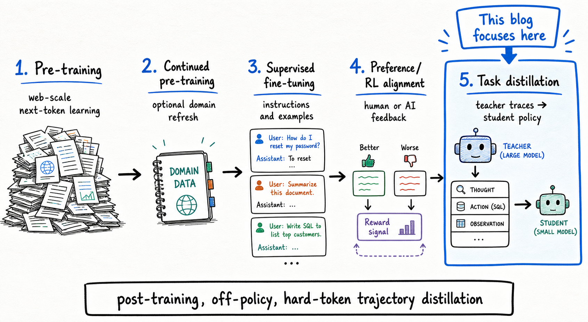

# Distilling A 0.8B SQL Tool-Use Agent

## Abstract

I tested whether a tiny model could learn the loop of a SQL agent: inspect the database, run queries, read observations, and submit corrected SQL. It did learn that loop. Qwen3.5-0.8B moved from almost never finishing the task to solving 44/220 held-out examples after supervised fine-tuning (SFT). But it did not inherit teacher-level SQL judgment.

The task is SQL repair over SQLite databases: given a user issue and buggy query, the model must inspect schema, run diagnostic SQL when useful, and submit corrected SQL that passes hidden deterministic tests. The method is offline hard-token trajectory distillation. GPT 5.5 medium and Qwen3.5-35B-A3B 8-bit run the harness first; only successful train trajectories are kept; and each teacher action becomes a supervised `conversation so far -> next structured action` row for smaller students. All models are evaluated on the same fixed 220-task held-out split and harness.

The best student result was Qwen3.5-2B trained on Qwen3.5-35B-A3B 8-bit rows at 58/220. Stronger baselines remained far ahead: Qwen3.5-35B-A3B 8-bit solved 96/220, GPT 5.4 mini solved 105/220, and GPT 5.5 medium solved 115/220. Same-family Qwen teacher rows gave small success gains, but also transferred loopier behavior, increasing repeated-action failures.

The main lesson is narrow but useful: hard-token trajectory SFT can transfer the agent protocol, but teacher-level SQL judgment under the student's own rollouts remains the hard part.

## 1. Introduction

Small models are attractive for agent systems for reasons that are not mysterious: they are cheaper to run, easier to serve locally, faster to iterate on, and more plausible to deploy in places where a large hosted model is too expensive or too heavy. This series is my attempt to explore practical ways to get more out of small language models. I am starting with the simplest useful method: off-policy hard-token distillation, where a stronger teacher runs the task first, I keep its successful trajectories, and then I fine-tune a smaller student to imitate the teacher's next actions.

The opening question was:

> Can a tiny model learn to act like a stronger model inside a real tool-use loop?

Not "can it write SQL-looking text?" Not "can it pass a prompt demo?" I wanted the small model to sit inside the same harness as the teacher, inspect a database, run SQL, read observations, and submit a final answer that passes deterministic hidden tests.

That distinction matters because tool-use agents ask for a different kind of competence than ordinary chat. They do not only need to produce a good final answer. They need to choose actions, respect an interface, read observations, recover from partial evidence, and decide when to stop.

The task is SQL repair. Each example gives the model a natural-language user issue, a buggy SQL query, and a SQLite database. The model can inspect the schema, run SQL queries, and eventually submit corrected SQL. The hidden tests and reference solution are not visible to the model.

This creates two coupled problems:

```text
operate the agent protocol correctly
choose the right SQL repair
```

A model can fail either layer. It can repeat schema inspection, emit an invalid action, run irrelevant diagnostic queries, never submit, or submit SQL that looks plausible but fails the hidden tests. For small agents, those are different failure modes, and separating them is one of the main reasons this experiment is useful.

The controlled world is fixed throughout the experiment: the same `birdsql/six-gym-sqlite` task source, the same `Query` category, the same four databases (`netflix`, `movie_3`, `books`, `chinook`), the same 879 train tasks, the same 220 held-out eval tasks, and the same harness contract. Small-agent results are easy to distort with changes to parsing, stopping rules, prompt shape, or eval split, so I kept the environment and benchmark fixed.

The post contributes five concrete things:

1. A SQL tool-use distillation setup where success is measured by deterministic hidden tests rather than an LLM judge.
2. A trajectory-to-supervised-fine-tuning (SFT) data pipeline that trains on intermediate tool-use decisions instead of only final answers.
3. A comparison between GPT 5.5 medium teacher rows and Qwen3.5-35B-A3B 8-bit same-family teacher rows.
4. Held-out evals for Qwen3.5-0.8B, Qwen3.5-2B, LiquidAI/LFM2.5-8B-A1B, Qwen3.5-35B-A3B 8-bit, GPT 5.4 mini, and GPT 5.5 medium.
5. Behavioral accounting beyond success rate: submit rate, wrong submissions, repeated-action stops, max-turn/runtime stops, token usage, turn counts, training time, and a negative submit-row weighting experiment.

## 2. Background: Distillation For Tool-Use Agents

Knowledge distillation means using a stronger teacher model to transfer useful behavior into a smaller student model. The simple version is "teacher solves task, student imitates teacher," but for agents the important question is more precise:

```text
what part of the teacher's behavior does the student learn from?
```

Before that, it helps to place this experiment in the training lifecycle. Pretraining is the broad next-token training stage that gives a model language, code, and world-pattern priors. Post-training is where we shape behavior for a use case: instruction tuning, supervised fine-tuning, preference optimization, reinforcement learning, safety tuning, tool-use training, or domain adaptation. This post is firmly in post-training. I did not pretrain a model. I took existing base/instruction models and used supervised fine-tuning to teach a specific agent policy inside a fixed environment.



A tool-use agent is not only producing an answer. It is choosing actions, receiving observations, updating its state, and deciding when to stop. That gives us several possible distillation signals.

| Distillation signal | What the student learns from | Why it matters |
| --- | --- | --- |
| Hard labels | The teacher's chosen output tokens | Simple supervised fine-tuning: "given this input, produce this target." |
| Soft labels / logits | The teacher's probability distribution over next tokens | Preserves uncertainty: the student can learn that some alternatives were plausible, not just which token won. |
| Feature distillation | Internal teacher activations or hidden states | Tries to align the student's representations with the teacher's internals. This usually needs direct model access and architecture-aware training. |
| Final-answer distillation | Only the completed teacher answer | Useful when the final response is the product, but weak for agents because it throws away the process. |
| Trajectory distillation | Intermediate actions, observations, and final answer | Teaches the policy: when to inspect, when to query, how to react, and when to submit. |
| Reward or RL-style methods | A scalar outcome such as pass/fail after rollout | Optimizes behavior through environment feedback instead of directly imitating each teacher action. |


Hard-label distillation is the most common starting point. The teacher produces a target, and the student is trained to predict those exact tokens. It is cheap, scalable, and compatible with ordinary supervised fine-tuning, but it is lossy: the student sees the teacher's selected output, not the teacher's uncertainty over alternatives.

Soft or logit distillation keeps that missing uncertainty. Instead of only saying "the next token is X," the teacher exposes a probability distribution over candidate tokens. That can be richer training data, but it requires a teacher path that exposes token probabilities or logits. A normal hosted chat API often does not give enough access for this.

Feature distillation goes deeper. The student tries to match some internal representation of the teacher, not just its outputs. That can be powerful, but it is also more invasive: you usually need access to teacher internals and a sensible way to align teacher and student layers.

Final-answer distillation is the "big model generates answers for small model" version. For SQL repair, that would mean:

```text
user issue + buggy SQL -> corrected SQL
```

That may teach some SQL repair skill, but it does not teach the student how to operate the environment. It never shows the decision boundary between `inspect_schema`, `run_sql_query`, and `submit_sql`.

Trajectory distillation keeps the teacher's process. A successful teacher run can become multiple training examples:

```text
conversation before turn 1 -> teacher action at turn 1
conversation before turn 2 -> teacher action at turn 2
conversation before turn 3 -> teacher action at turn 3
```

Reward and reinforcement-learning-style methods are the other major family. Instead of imitating the teacher's next action, the student acts in the environment, receives a score, and updates toward behavior that scores better. For this benchmark, the reward is natural: did the submitted SQL pass the hidden tests? That is not the method in this first post.

This post uses **offline hard-token trajectory distillation**. Offline means the teacher runs first and training happens later from saved traces. Hard-token means the student trains on the teacher's chosen action tokens, not logits. Trajectory means the training rows come from intermediate tool-use decisions, not only final SQL.

So the unit of learning is:

```text
full conversation state before the teacher action -> canonical next executable action
```

That choice keeps the experiment intentionally simple while still matching the behavior I wanted to transfer: not just SQL knowledge, but the action pattern of a tool-use agent.

## 3. Problem Setup: SQL Repair In A Fixed Harness

The benchmark is [`birdsql/six-gym-sqlite`](https://huggingface.co/datasets/birdsql/six-gym-sqlite). Before the tables, here is the kind of held-out task the model sees:

```text
Database: chinook

User issue:
I want to find the latest track_id and use that id to filter records
in the track table.

Buggy SQL:
WITH vars AS (SELECT COUNT(*) AS vars_id FROM track)
SELECT * FROM track WHERE track_id = vars_id
```

The bug is subtle but common: `COUNT(*)` is not the latest id. The intended shape is to use `MAX(track_id)`. The buggy SQL is useful evidence, but it is not truth. It often points to the right tables and columns, while also anchoring the model to the wrong operation.

A weak model can fail before it reaches the SQL reasoning. It may inspect the schema, inspect again, then repeat itself until the harness stops. A better model can drive the harness but still submit the wrong SQL. A successful model has to do both:

```text
use the harness correctly
choose the right SQL repair
```

Each task contains:

| Field | Role in the harness |
| --- | --- |
| User issue | Natural-language description of what is wrong or desired |
| Buggy SQL | The user's incomplete or incorrect starting point |
| SQLite database template | The database the model can inspect and query |
| Preprocessing SQL | Setup applied before the task, when needed |
| Hidden tests | Deterministic scoring checks, hidden from the model |
| Reference SQL | A known solution, hidden from the model |

The model only sees the user issue, buggy SQL, database id, and observations produced by its own tool calls. It does not see the hidden tests or reference SQL.


For this post I narrowed the task distribution instead of trying to cover the whole dataset at once:

| Setting | Value |
| --- | --- |
| Task category | `Query` |
| Databases | `netflix`, `movie_3`, `books`, `chinook` |
| Source rows scanned | 5000 |
| Candidate rows after filtering | 1099 |
| Train split | 879 tasks |
| Eval split | 220 tasks |
| Split seed | 42 |

The database mix is intentionally ordinary: media catalogs, books, movies, and a Chinook-style music store. That keeps the experiment focused on agent behavior and SQL repair instead of on an extremely broad database distribution.

The split by database was:

| Database | Candidate tasks | Train tasks | Eval tasks |
| --- | ---: | ---: | ---: |
| `books` | 282 | 226 | 56 |
| `chinook` | 251 | 201 | 50 |
| `movie_3` | 273 | 218 | 55 |
| `netflix` | 293 | 234 | 59 |
| **Total** | **1099** | **879** | **220** |

The harness gives the model exactly three possible actions:

```json
{"action": "inspect_schema"}
{"action": "run_sql_query", "sql": "SELECT ..."}
{"action": "submit_sql", "sql": ["SQL statement 1", "SQL statement 2"]}
```

That is the contract every model has to live inside. The loop is:

```text
build messages from task
ask model for one structured action
parse the action
execute the action
append an observation if the task is not done
repeat until submit, failure, or max turns
```

If the model chooses `inspect_schema`, the harness returns schema text for the SQLite database. If the model chooses `run_sql_query`, the harness executes that query against a task-local database and returns rows or an error. If the model chooses `submit_sql`, the harness runs the hidden tests and records pass or fail.

I used BAML as the structured-output layer around this loop. In practical terms, BAML defines the action schema, renders the model request, parses the model's structured response, and gives the harness an object it can validate and execute. That is part of the harness design, not a trick to rescue bad generations. I did not tune the benchmark, action schema, parser, or stop rules separately for different models.

There is no fake user conversation and no LLM judge. The environment is SQLite plus a deterministic evaluator.

That makes the stop reasons meaningful:

| Stop reason | What it means |
| --- | --- |
| `submitted` | The model submitted final SQL; the SQL either passed or failed hidden tests |
| `parse_failure` | The model did not produce a valid structured action |
| `repeated_action` | The model repeated an action that the harness considered unproductive |
| `max_turns` | The model kept acting but never reached a valid final submission |
| `runtime_error` | The model call or harness call failed during the task |

These categories separate protocol failures from SQL failures. A model that repeats `inspect_schema` forever has not learned the tool-use loop. A model that submits syntactically valid SQL that fails the hidden tests can operate the harness, but is making wrong SQL decisions.

For tool-use agents, formatting is not superficial. A human can read:

```text
I should inspect the schema first.
```

But the harness needs:

```json
{"action":"inspect_schema"}
```

The target format is intentionally narrow because the environment needs executable actions. The harness is not searching for words like "schema" or "submit" in free-form text. It expects a structured action, normalizes it, validates the action name and argument types, and then executes the result.

That is the fixed world for the rest of the experiment.

## 4. Method: From Teacher Trajectories To SFT Rows

The method has one sentence version:

```text
Teach the student to choose the next executable action
that a successful teacher chose in the same environment state.
```

The teacher and student live inside the same runtime loop. The teacher is not producing detached explanations for a dataset. It is using the actual environment the student will later be evaluated in.


The runtime has five pieces:

```text
fixed dataset split
  -> SQL harness
  -> model serving path
  -> teacher trace / eval output
  -> student training path
```

The **dataset split** defines the world. Teacher-data runs use the 879 train tasks. The held-out eval uses the separate 220 eval tasks.

The **SQL harness** owns the environment. It builds the messages for a task, asks the model for one action, parses that action, executes the corresponding SQLite tool call, appends the observation, and repeats until the model submits, fails parsing, repeats an unproductive action, hits the turn limit, or hits a runtime failure.

The **model serving path** is swappable. GPT 5.5 medium and GPT 5.4 mini are evaluated as GPT models. Qwen3.5-35B-A3B 8-bit is evaluated locally through MLX, Apple's model runtime for Apple Silicon. Fine-tuned student adapters are evaluated on the CUDA training machine.

The **teacher trace output** is the bridge between inference and training. During teacher generation, the harness records each parsed action and the conversation state around it. During student eval, that extraction path is off; the student just acts and gets scored.

The **student training path** fine-tunes small models with LoRA (low-rank adaptation) on canonical teacher-action rows.

Both teacher-data rounds used the same 879 train tasks. I kept only successful trajectories, then converted each successful trajectory into canonical next-action SFT rows.

| Teacher source | Success | Submitted | Other stops | Parsed actions | Avg turns | Source SFT rows |
| --- | ---: | ---: | --- | ---: | ---: | ---: |
| GPT 5.5 medium | 446/879 = 50.7% | 879 | 0 parse / 0 repeat / 0 max-runtime | 2262 | 2.57 | 1046 |
| Qwen3.5-35B-A3B 8-bit | 394/879 = 44.8% | 816 | 0 parse / 32 repeat / 31 max-runtime | 3064 | 3.49 | 1232 |

Those SFT row counts are larger than the successful-task counts because the unit of supervision is not a whole task. The unit is one decision point inside a successful trajectory.


A successful trajectory might look like this:

```text
turn 1: inspect_schema
observation: schema text

turn 2: run_sql_query
observation: rows or SQL error

turn 3: submit_sql
score: pass
```

That one passed task can become three supervised rows:

```text
conversation before turn 1 -> {"action":"inspect_schema"}
conversation before turn 2 -> {"action":"run_sql_query","sql":"..."}
conversation before turn 3 -> {"action":"submit_sql","sql":["..."]}
```

The input side is the full conversation state before the teacher action: system instructions, database id, user issue, buggy SQL, prior assistant actions, and environment observations. The target side is the next canonical action.

Canonicalization matters. BAML lets the teacher response include helper fields, but the student is not trained to reproduce free-form teacher prose. It is trained to produce the executable action the harness accepts.

The conservative filtering rule was:

```text
only commit rows from trajectories where the whole task passed hidden tests
```

That choice loses some data, but it avoids a credit-assignment problem that shows up immediately in agent traces. A failed trajectory can contain locally reasonable actions:

```text
inspect_schema -> good
run_sql_query -> good
submit_sql -> wrong
```

The first two actions may be useful. But if I keep them, I am now making a more subtle claim: I know which local actions inside a failed plan deserve credit. For this first run, I did not want that ambiguity in the dataset. I kept the meaning simple: every row came from a teacher run that completed the task successfully.


The full data flow was:

```text
run teacher on train task
  -> collect candidate action rows during the trajectory
  -> score final submitted SQL with hidden tests
  -> if the trajectory passed, keep its candidate rows
  -> canonicalize the assistant action targets
  -> render each full chat training example
  -> filter by full rendered sequence length
  -> split kept rows into train/validation
  -> run LoRA SFT on the assistant action target
```

The length filter is easy to get wrong. I did not filter only by the target JSON length. I filtered by the full rendered training sequence: system message, user task, prior actions, environment observations, and the canonical assistant target. The target is usually short. The context can be long because schema observations and multi-turn histories accumulate.

## 5. Experimental Setup

All runs used the same SQL tool-use harness, hidden SQLite tests, and fixed held-out split. Teacher traces were generated only on train tasks. Every reported benchmark result used the 220-task eval split.

| Piece | Setup |
| --- | --- |
| Local workbench | Mac with 128 GB unified memory for dataset prep, notebooks, MLX serving/eval, GPT evals, charts, and blog artifacts |
| Training machine | Rented NVIDIA RTX 3090 CUDA server for LoRA SFT and some direct Hugging Face PEFT evals; adapters and eval JSONs synced back to the Mac |
| First teacher | GPT 5.5 medium |
| Same-family teacher | `mlx-community/Qwen3.5-35B-A3B-8bit` |
| Hosted smaller baseline | GPT 5.4 mini |
| Students | `unsloth/Qwen3.5-0.8B`, `unsloth/Qwen3.5-2B`, `LiquidAI/LFM2.5-8B-A1B` |

I keep the model names readable but explicit. In particular, Qwen3.5-35B-A3B 8-bit is the larger local Qwen-family model used both as a strong baseline and as the same-family teacher source.

The row-retention numbers after full-example length filtering were:

| Dataset / training path | Source rows | Kept at 4096 | Dropped | Final train / validation | Token length min / P50 / P90 / P95 percentiles |
| --- | ---: | ---: | ---: | ---: | ---: |
| GPT 5.5 rows, Qwen SFT | 1046 | 1042 | 4 | 990 / 52 | 605 / 1786 / 2948 / 3208 |
| Qwen3.5-35B-A3B 8-bit rows, Qwen SFT | 1232 | 1211 | 21 | 1151 / 60 | 604 / 2014 / 3180 / 3531 |
| Qwen3.5-35B-A3B 8-bit rows, LFM SFT | 1232 | 1226 | 6 | 1165 / 61, validation disabled | 569 / 1907 / 2984 / 3335 |

The longest source rows before filtering were 15836 tokens for the GPT-row Qwen path, 5908 for the Qwen-row Qwen path, and 5297 for the Qwen-row LFM path. The target action was usually short; most of the length came from schema observations and multi-turn history.

In the token tables, P50 is the median and P90/P95 show the longer-tail examples.

For reporting, I also split the frozen SFT JSONL rows into prompt/history tokens and target/action tokens with a shared tokenizer estimate. This answers a slightly different question: how much of each row is context, and how much is the assistant action the student learns to generate?

| SFT row token estimate | Teacher rows | Mean | P50 | P90 | P95 |
| --- | --- | ---: | ---: | ---: | ---: |
| Prompt/history before target | GPT 5.5 | 1339 | 1345 | 2367 | 2552 |
| Target action JSON | GPT 5.5 | 90 | 69 | 192 | 259 |
| Prompt plus target | GPT 5.5 | 1431 | 1447 | 2516 | 2745 |
| Prompt/history before target | Qwen3.5-35B-A3B 8-bit | 1558 | 1556 | 2578 | 2862 |
| Target action JSON | Qwen3.5-35B-A3B 8-bit | 83 | 71 | 150 | 191 |
| Prompt plus target | Qwen3.5-35B-A3B 8-bit | 1643 | 1663 | 2693 | 3013 |

The important shape is obvious: the target is short, while the context can be long. The student is mostly learning to emit a compact action after reading a growing task state.

For eval, I gave the local Hugging Face PEFT student path a larger input window than training: `max_seq_length=8192`. PEFT means parameter-efficient fine-tuning; here, the trainable parameters are LoRA adapters rather than the full model. The context length is the maximum rendered conversation context the evaluator allows before generation. It helps avoid cutting off long schema/tool histories during rollout. The generated output budget was separate: `max_new_tokens=512` for the local student/base evals. So "context length" means the input/history budget, while "max new tokens" means the maximum assistant action text the model may generate on one turn.

| Run family | Input/history budget | Output budget per turn | Max turns | Timeout | Temperature |
| --- | ---: | ---: | ---: | ---: | ---: |
| CUDA local Hugging Face PEFT students and bases | 8192 tokens | 512 new tokens | 8 | 180s/task | 0.0 |
| GPT 5.5 medium teacher eval | model/provider context | 1024 new tokens | 8 | 180s/task | 0.0 |
| GPT 5.4 mini hosted eval | model/provider context | 2048 new tokens | 8 | 180s/task | 0.0 |
| Qwen3.5-35B-A3B 8-bit MLX eval | MLX model context | 2048 new tokens | 8 | 180s/task | 0.0 |
| LiquidAI/LFM2.5-8B-A1B-MLX-8bit base eval | MLX model context | 2048 new tokens | 8 | 180s/task | 0.0 |

The GPT models and Qwen3.5-35B-A3B 8-bit runs record `max_new_tokens` and turn/time limits, while the model serving side owns the exact prompt-context capacity. The local Hugging Face PEFT student path records an explicit `max_seq_length=8192` because it renders and runs the model directly.

Training was response-only LoRA SFT on the canonical assistant action. I did not train on failed teacher trajectories, hidden tests, reference SQL, or teacher free-form prose.

| Setting | Value |
| --- | --- |
| Backend | CUDA / Unsloth-style SFT |
| Epochs | 3 |
| Optimizer updates | 372 for GPT rows; 432 for Qwen-row Qwen students; 438 for Qwen-row LFM |
| Batch / grad accumulation / effective batch | 1 / 8 / 8 |
| Learning rate / seed | `5e-5` / 42 |
| LoRA rank / alpha | 32 / 32 |
| Precision | bf16 (bfloat16), 16-bit LoRA, not 4-bit |
| Qwen target modules | `q_proj`, `k_proj`, `v_proj`, `o_proj`, `gate_proj`, `up_proj`, `down_proj` |
| LFM target modules | `in_proj`, `out_proj`, `q_proj`, `k_proj`, `v_proj`, `w1`, `w2`, `w3` |

| Student | Trainable LoRA parameters |
| --- | ---: |
| Qwen3.5-0.8B | 12.78M of 865.77M, about 1.48% |
| Qwen3.5-2B | 21.82M of 2.24B, about 0.98% |
| LFM2.5-8B-A1B | 11.40M of 8.48B, about 0.13% |

I used this as a boring first recipe, not a hyperparameter search. Three epochs gave each kept row multiple passes without turning the post into an optimizer sweep. A `5e-5` learning rate, rank/alpha 32, seed 42, and bfloat16 LoRA kept the runs comparable across students. I avoided 4-bit training here because the models fit with 16-bit LoRA on the GPU path, and I wanted the first result to be less entangled with quantization behavior.

## 6. Experiments And Results

All results here use the same 220-task held-out eval split and the same SQL-agent harness. The harness did not change between base models, SFT students, the submit-row ablation, the same-family Qwen teacher run, and the hosted baselines. A success means the model reached `submit_sql` and the submitted SQLite passed the hidden tests.

The headline is easier to read as behavior first: base students mostly failed the loop, SFT made them submit, and the remaining failures were mostly wrong SQL. The exact numbers matter, but that is the argument to keep in mind while reading the charts.

For scale, here are the strong baselines first:


| Strong baseline | Success | Wrong submits | Parse stops | Repeat stops | Max/runtime stops | SQL exec errors |
| --- | ---: | ---: | ---: | ---: | ---: | ---: |
| Qwen3.5-35B-A3B 8-bit local MLX eval | 96/220 = 43.6% | 106 | 0 | 9 | 9 | 4 |
| GPT 5.4 mini hosted baseline | 105/220 = 47.7% | 115 | 0 | 0 | 0 | 4 |
| GPT 5.5 medium teacher/baseline | 115/220 = 52.3% | 105 | 0 | 0 | 0 | 1 |

The GPT baselines submitted on every task and had no parse, repeat, max-turn, or runtime stops. Their failures were almost entirely wrong SQL submissions. That is the healthier failure shape: they know how to drive the harness, but still miss some SQL repairs. Qwen3.5-35B-A3B 8-bit sits between the students and GPT models: much stronger task success than the students, but still with some repeat and max/runtime stops.

### 6.1 Student Results

The first result was the base-model behavior. The Qwen base students mostly did not operate the harness at all. Qwen3.5-0.8B solved 1/220 tasks and Qwen3.5-2B solved 0/220. Both submitted only once. Their dominant failure mode was repeated action: 208 repeat stops for Qwen3.5-0.8B and 219 for Qwen3.5-2B. Before distillation, the problem was not only SQL correctness. The models were often failing the control loop before they reached a serious SQL decision.

LiquidAI/LFM2.5-8B-A1B-MLX-8bit behaved differently as a base model. It solved 9/220 and submitted on 31 tasks, so it reached the protocol more often than the Qwen bases. But most of its failures were still harness-control failures: 52 repeat stops and 137 max-turn/runtime stops.


The GPT-teacher SFT runs changed the shape of the failures. Qwen3.5-0.8B trained on GPT 5.5 medium rows went from 1/220 to 44/220. More importantly, it submitted on 204/220 tasks. Qwen3.5-2B trained on the same GPT teacher rows solved 57/220 and submitted on 206/220. LiquidAI/LFM2.5-8B-A1B trained on the GPT rows solved 47/220 and submitted on 186/220.

The students learned to inspect, query, and submit. They did not become teacher-level SQL repair models. For the GPT-row students, most remaining failures were wrong submissions: 160 wrong submits for Qwen3.5-0.8B, 149 for Qwen3.5-2B, and 139 for LiquidAI/LFM2.5-8B-A1B.

The detailed student failure ledger is worth keeping because the chart shows the shape, while the table preserves the exact stop counts:

| Student run | Success | Wrong submits | Parse stops | Repeat stops | Max/runtime stops | SQL exec errors |
| --- | ---: | ---: | ---: | ---: | ---: | ---: |
| Qwen3.5-0.8B base | 1/220 = 0.5% | 0 | 11 | 208 | 0 | 0 |
| Qwen3.5-0.8B SFT on GPT 5.5 rows | 44/220 = 20.0% | 160 | 6 | 10 | 0 | 45 |
| Qwen3.5-0.8B SFT on Qwen3.5-35B-A3B 8-bit rows | 46/220 = 20.9% | 109 | 7 | 54 | 4 | 5 |
| Qwen3.5-0.8B SFT on GPT rows, `submit_sql` 2x | 38/220 = 17.3% | 161 | 9 | 11 | 1 | 52 |
| Qwen3.5-2B base | 0/220 = 0.0% | 1 | 0 | 219 | 0 | 0 |
| Qwen3.5-2B SFT on GPT 5.5 rows | 57/220 = 25.9% | 149 | 5 | 9 | 0 | 49 |
| Qwen3.5-2B SFT on Qwen3.5-35B-A3B 8-bit rows | 58/220 = 26.4% | 91 | 3 | 65 | 3 | 2 |
| LiquidAI/LFM2.5-8B-A1B-MLX-8bit base | 9/220 = 4.1% | 22 | 0 | 52 | 137 | 8 |
| LiquidAI/LFM2.5-8B-A1B SFT on GPT 5.5 rows | 47/220 = 21.4% | 139 | 7 | 27 | 0 | 34 |
| LiquidAI/LFM2.5-8B-A1B SFT on Qwen3.5-35B-A3B 8-bit rows | 50/220 = 22.7% | 120 | 6 | 38 | 6 | 12 |

I also tried a narrow submit-row ablation for Qwen3.5-0.8B: duplicate each final `submit_sql` row once in the GPT-teacher SFT data. The idea was to make the student more decisive at the final-answer step.

It did not help. The normal Qwen3.5-0.8B GPT-row adapter solved 44/220; the submit-weighted adapter solved 38/220. It lost 17 tasks the normal adapter solved, gained 11 different tasks, and increased SQL execution errors from 45 to 52. The normal SFT model was already submitting on 204/220 tasks, so the bottleneck had moved from "will it submit?" to "is the submitted SQL actually right?"

### 6.2 What If The Teacher Is From The Same Family?

The same-family teacher experiment was the one I was most curious about:

```text
What if the teacher is Qwen3.5-35B-A3B 8-bit,
from the same family as Qwen3.5-0.8B and Qwen3.5-2B,
even though it scores lower than GPT 5.5 medium on the eval?
```

This is not a strange question. In distillation, a stronger teacher is not always the better teacher. A teacher can be very capable but produce traces that are stylistically or distributionally harder for a student to imitate. A same-family teacher may use action patterns, JSON shape, intermediate steps, tokenizer behavior, and model-family priors that are easier for the student to learn.

GPT 5.5 medium was the stronger teacher on both train and held-out eval: it solved 446/879 train tasks and 115/220 held-out tasks. Qwen3.5-35B-A3B 8-bit solved fewer train tasks, 394/879, and scored 96/220 on held-out eval. But its successful train trajectories were longer, so they produced more SFT rows: 1232 Qwen-teacher rows versus 1046 GPT-teacher rows.


In the chart, the left panel counts solved eval tasks, where higher is better. The right panel counts `repeated_action` stops on the same 220 eval tasks, where lower is better. That right panel is the loop-control cost: how often the student got stuck repeating an unproductive action/state until the harness stopped the task.

The same-family Qwen rows gave small success gains across all three students: Qwen3.5-0.8B moved from 44 to 46, Qwen3.5-2B from 57 to 58, and LiquidAI/LFM2.5-8B-A1B from 47 to 50. But the right panel is the warning label. Repeat stops rose from 10 to 54 for Qwen3.5-0.8B, from 9 to 65 for Qwen3.5-2B, and from 27 to 38 for LiquidAI/LFM2.5-8B-A1B.

So the same-family teacher did transfer something useful, but it also transferred a loopier policy. The Qwen3.5-35B-A3B 8-bit teacher itself had more loop-control failures than GPT 5.5 medium, and some of that behavior showed up in the students.


The harness behavior chart is the real result. The success chart tells us who solved more tasks, but the behavior chart tells us what changed.

The base Qwen students are mostly repeat-stop bars. They are not consistently reaching the final answer step. GPT-row SFT turns those bars into mostly submissions. That is the core distillation win: the small models learned the agent interface. The same-family Qwen rows add a few correct submissions, but they also add many more repeat stops. That is not a clean improvement; it is a tradeoff.

The cleanest summary is:

```text
SFT changed the students from "does not really operate the harness"
into "operates the harness, but often submits wrong SQL."
```

## 7. Analysis: Tokens, Turns, Validation Loss, And Hardware

The success charts tell one story, but agent runs also need accounting for how the model spent its turns. A model that solves more tasks by taking many extra tool calls is not the same kind of improvement as a model that solves more tasks with cleaner decisions. So I tracked generated tokens, available prompt/input estimates, average turns, and validation loss separately from final task success.

The token accounting here is approximate in a specific way. The eval JSONs did not persist provider billing counters. For the runs where full prompt reconstruction was available, I replayed the saved BAML-rendered messages before each model call, counted those as prompt/history tokens, counted the saved assistant action JSON as generated output, and aggregated across the task with one shared tokenizer estimate.

For the newer Qwen3.5-35B-A3B 8-bit teacher-row student evals, the saved eval outputs preserve generated BAML outputs but not every full rendered prompt before each call, so I report generated-output tokens and turns there without inventing prompt totals.


The student generated-token chart makes the same-family teacher effect visible. The students trained on Qwen3.5-35B-A3B 8-bit rows did not mainly become more verbose per action. Their actions were still short structured JSON. What changed is that they took more turns. More turns means more generated output per task, and more importantly it means more chances for the student to drift into a state the teacher never supervised.

The LiquidAI/LFM2.5-8B-A1B-MLX-8bit base row is approximate because many invalid BAML generations were not saved as clean assistant messages. I used the saved output-token counters for invalid generations and the saved parsed outputs where available. The qualitative pattern is still clear: base LFM output was raw and verbose, while the fine-tuned LFM outputs were much closer to short executable actions.


The teacher and strong-baseline token chart uses its own scale. Qwen3.5-35B-A3B 8-bit often produced shorter action text per call than GPT 5.5 medium, but it took more turns, so its generated output per task ended up higher. GPT 5.4 mini was the best efficiency point among the strong baselines I measured: close to GPT 5.5 medium in task success, with fewer turns and fewer generated tokens per task.

The prompt side is usually larger than the generated side. Each extra turn does not only add one assistant action; it also makes the next prompt resend the system instructions, task, prior actions, schema observations, query results, and structured-output instructions. That is why turns matter twice.

For the initial GPT-row and baseline runs where prompt reconstruction was available, the prompt/input and total estimates looked like this:

| Run | Prompt/call mean | Prompt/call P90 | Total/task mean |
| --- | ---: | ---: | ---: |
| Qwen3.5-0.8B base | 1118 | 1993 | 2881 |
| Qwen3.5-0.8B SFT, GPT 5.5 medium rows | 1568 | 2545 | 4130 |
| Qwen3.5-0.8B SFT, submit x2 | 1603 | 2581 | 4411 |
| Qwen3.5-2B base | 1399 | 2420 | 2878 |
| Qwen3.5-2B SFT, GPT 5.5 medium rows | 1611 | 2586 | 4400 |
| LiquidAI/LFM2.5-8B-A1B SFT, GPT 5.5 medium rows | 1620 | 2600 | 4412 |
| Qwen3.5-35B-A3B 8-bit local eval | 1872 | 2939 | 7000 |
| GPT 5.4 mini hosted baseline | 1471 | 2522 | 3354 |
| GPT 5.5 medium teacher/baseline | 1590 | 2601 | 4287 |

The important lesson is not that SFT made the small models "more expensive" in a bad way. It made them behave more like agents. The base Qwen models often failed before doing much useful interaction. The fine-tuned models inspected, queried, and submitted, so their average context grew.

The validation losses show the mismatch cleanly. For Qwen3.5-0.8B, final validation loss improved from `0.3494` with GPT 5.5 rows to `0.2553` with Qwen3.5-35B-A3B 8-bit rows. For Qwen3.5-2B, it improved from `0.2966` to `0.2051`. Under teacher-forced supervised fine-tuning, the same-family rows were clearly easier for the Qwen students to predict.

The held-out rollout did not improve nearly as much. The Qwen3.5-35B-A3B 8-bit teacher rows nudged task success up only slightly, while repeated-action stops got worse. Validation loss asks, "Can the model predict the teacher's next action given the teacher-style context?" The harness asks, "Can the model recover from its own previous actions, choose useful SQL probes, and submit SQL that passes hidden tests?"

Those are related, but they are not the same measurement.

### 7.1 Training Time And Hardware

The Qwen3.5-35B-A3B 8-bit teacher-row runs took longer because they kept more rows, ran more optimizer updates, and had longer median context.


Wall time moved from 15.9m to 22.4m for Qwen3.5-0.8B, from 22.1m to 29.4m for Qwen3.5-2B, and from 57.4m to 71.8m for LiquidAI/LFM2.5-8B-A1B.

The Mac was useful for capacity-heavy local work because 128 GB unified memory can hold larger quantized models for serving and inspection. The RTX 3090 server was better for LoRA training because the bottleneck was repeated forward/backward/update throughput, where CUDA kernels, tensor cores, and GPU-local bandwidth mattered more than host memory size.

This is the difference between RAM capacity and training throughput. The Mac can be comfortable for local orchestration, data preparation, chart generation, and serving some quantized models. But training is a dense numerical workload. Even with less total memory, an NVIDIA GPU can keep the training tensors close to the compute units and run optimized CUDA kernels for attention, MLPs, backward passes, and optimizer updates. That is why a 24 GB VRAM card can train these adapters much faster than a 128 GB unified-memory Mac, even though the Mac has more total memory.

LiquidAI/LFM2.5-8B-A1B took the longest because it is a much larger model and used an eager expert-execution path in this training setup. I disabled in-loop validation for the LFM runs because validation compilation was unreliable in that environment. The deterministic 220-task harness eval remained the comparison point.

## 8. Discussion And Lessons

The most useful thing this experiment gave me was not a single success number. It was the failure decomposition.

If I only looked at solved tasks, I would say "SFT helped." That is true, but incomplete. The harness behavior chart explains how it helped. The base Qwen students mostly failed before they became useful agents: repeated actions, no valid final submission, or stalled rollouts. After trajectory SFT, the models reached `submit_sql` far more often. That means the training transferred the protocol: inspect, query, observe, submit.

But the failures moved downstream. The fine-tuned models often submitted wrong SQL. That is a better failure than never submitting, but it is still a failure. This is why the stop reasons matter. A repeat stop, a parse stop, a wrong submit, and a SQL execution error are not interchangeable. They point to different missing capabilities.

The second lesson is that I was right to be conservative with the data. I only trusted successful trajectories. If a teacher inspected the schema correctly, ran a reasonable query, and then submitted wrong SQL, I did not keep the earlier actions from that failed task. That probably threw away some locally good examples, but it kept the dataset meaning clean: every supervised row came from a rollout that passed the hidden tests.

For an agent, local action quality is hard to judge outside the whole trajectory. A query can be useful in one plan and distracting in another. A final submission can be perfectly formatted and still wrong. Keeping only successful trajectories avoided teaching from traces whose credit assignment I could not defend.

The third lesson is that more rows and lower validation loss were not enough. The Qwen3.5-35B-A3B 8-bit teacher produced more SFT rows than the GPT teacher because its successful trajectories were longer. The Qwen students trained on those rows also reached much lower validation loss. On paper, that looked like a cleaner imitation problem.

The rollout results were much less dramatic. Task success improved only slightly, while repeated-action stops got worse. That is the gap between teacher-forced validation and agent rollout. A model can learn that the next valid-looking action should be `inspect_schema`, `run_sql_query`, or `submit_sql` without learning when the SQL evidence is actually sufficient. It can emit perfect canonical JSON and still submit a wrong query. It can run a query that looks locally reasonable, receive an observation the teacher never saw, and then compound the mistake.

The same-family teacher result was the most interesting mixed result. Qwen3.5-35B-A3B 8-bit helped the Qwen students a little. That supports the intuition that a same-family teacher can be easier to imitate: similar tokenizer behavior, similar action style, similar priors, and more familiar intermediate traces.

But it also hurt in the shape of the failures. The same-family teacher was loopier than GPT 5.5 medium, and some of that loopiness appeared to transfer. Same-family distillation is not automatically cleaner distillation. It can transfer useful habits and bad habits at the same time.

The submit-row weighting experiment gave another useful negative result. Duplicating final `submit_sql` rows sounded reasonable because the base models had trouble finishing. But by the time the normal SFT adapter was evaluated, the main bottleneck had already shifted. The model was submitting on most tasks; it was just submitting wrong SQL too often. More submit pressure did not fix SQL quality. It made the model more decisive without making it more correct.

The sparse/larger model result was another reminder not to rank models by size alone. LiquidAI/LFM2.5-8B-A1B did not automatically dominate the smaller Qwen students in this harness. It was larger and structurally different, but the base model still struggled with the action protocol, and the fine-tuned run did not turn that into a clear win. For this task, model size, architecture, teacher match, parsing behavior, and rollout stability all mattered.

So the real lesson is narrower and more useful than "distillation works" or "distillation fails." Once the model learns to act, the remaining problem becomes harder to hide: it has to make correct decisions under its own rollouts.

## 9. Conclusion

So, can a tiny model learn to act like a stronger model inside a real tool-use loop?

Yes, but only in the specific sense this experiment measured. Hard-token trajectory distillation transferred the protocol: inspect the schema, run queries, read observations, and submit structured actions. Qwen3.5-0.8B moved from almost never reaching a valid finish line to solving 44/220 held-out tasks after GPT 5.5 medium teacher SFT, and the best student reached 58/220.

But that was not teacher-level SQL judgment. The stronger baselines were still far ahead: Qwen3.5-35B-A3B 8-bit solved 96/220, GPT 5.4 mini solved 105/220, and GPT 5.5 medium solved 115/220. The small models learned to operate the harness; they did not inherit the teacher's ability to reliably choose the right SQL.

That is the result: protocol transfer, yes. Teacher-level SQL judgment, no.
