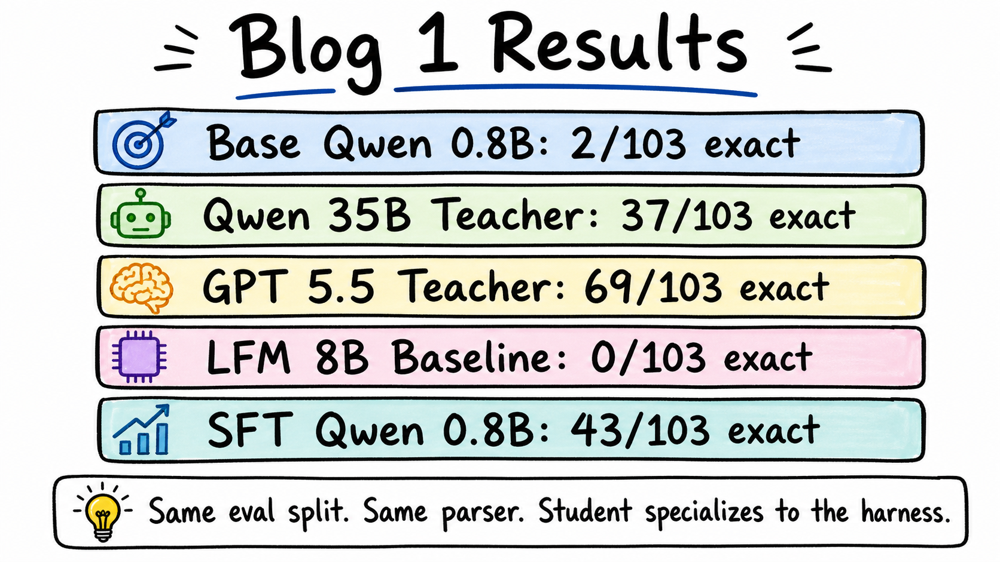
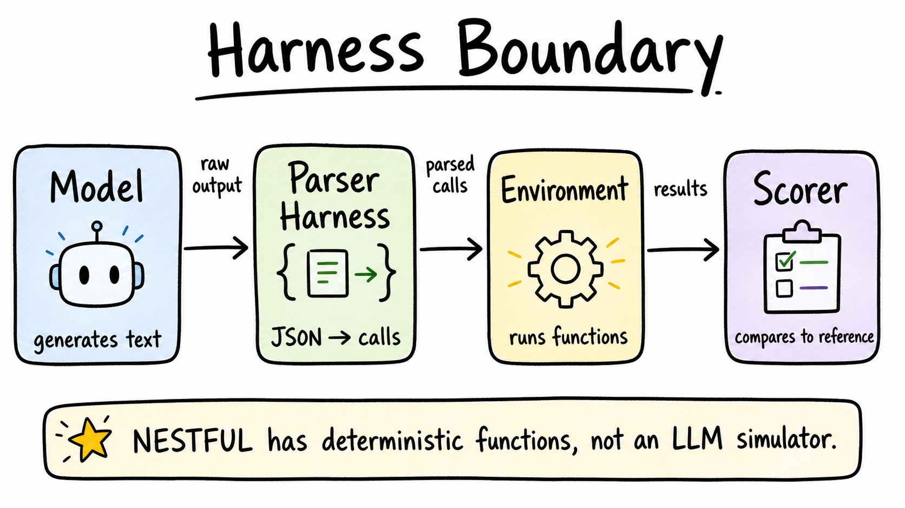
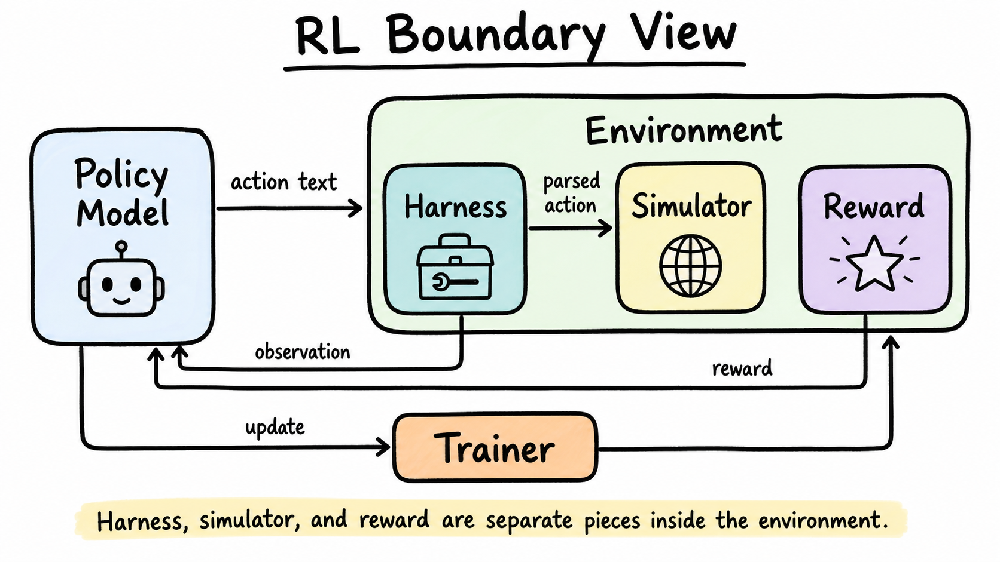
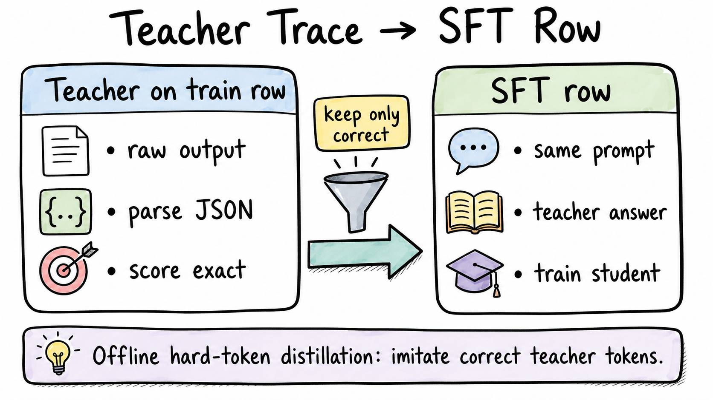

# Distilling A 0.8B Function-Calling Model

This post is about a small, practical kind of distillation:

> Can a tiny model become good at one narrow function-calling harness if we train it on correct traces from a stronger teacher?

The answer here was yes. Not in a vague "small model got smarter" way, but in a concrete harness-specific way:

| Run | Exact | Name Sequence | Parse Rate |
| --- | ---: | ---: | ---: |
| Base Qwen3.5-0.8B MLX | 2/103 | 7/103 | 83/103 |
| Qwen3.5-35B-A3B 8-bit teacher | 37/103 | 39/103 | 98/103 |
| GPT 5.5 medium teacher | 69/103 | 78/103 | 103/103 |
| LFM2.5-8B-A1B MLX 8-bit baseline | 0/103 | 0/103 | 0/103 |
| Qwen3.5-0.8B MLX after Qwen-teacher SFT | 43/103 | 53/103 | 99/103 |

The surprising line is the last one. The fine-tuned 0.8B model scored higher than the zero-shot Qwen 35B teacher on the same held-out eval split.

That does **not** mean the 0.8B model became generally better than the teacher. It means the student became more specialized to this narrow task, output format, and harness than the teacher was in a zero-shot setting.



## The Task

I used a short-call slice of [NESTFUL](https://huggingface.co/datasets/ibm-research/nestful). Each row gives the model:

- a user request
- a catalog of available functions
- an expected nested function-call sequence

The model must return JSON function calls. Later calls can reference outputs from earlier calls:

```json
[
  {
    "name": "compute_mean",
    "label": "$var_1",
    "arguments": {
      "two_d_list": [[1, 2, 3], [4, 5, 6], [7, 8, 9]]
    }
  },
  {
    "name": "modular_exponentiation",
    "label": "$var_2",
    "arguments": {
      "a": "$var_1.output_0$",
      "b": 2,
      "c": 3
    }
  }
]
```

For Blog 1, I filtered to rows whose reference solution has at most two function calls. That gave:

- train rows: `506`
- eval rows: `103`
- fixed split seed: `42`

The eval split is held out. The student never trains on those eval labels.

## The Harness Boundary

This benchmark is not a chatty multi-turn simulator. It is a one-turn function-calling harness.

The model sees the user query and tool catalog once. It emits a complete call plan. The harness parses that plan, resolves nested references, executes deterministic functions, and scores the result.



The important separation is:

- **model:** generates text
- **parser harness:** decides whether the text is a valid call sequence
- **environment / executor:** runs deterministic functions and resolves `$var_1.output$`
- **scorer:** compares against the reference sequence

This matters because the first result looked worse than reality. The original strict parser accepted only one JSON array. The base student often emitted multiple top-level JSON objects instead:

```json
{"name": "detokenize", "label": "$var_1", "arguments": {"token_list": ["Hello", "world"]}}
{"name": "extract_first_name", "label": "$var_2", "arguments": {"name": "$var_1.output_0"}}
```

That is not the exact format we asked for, but it is still structured JSON. The fair harness should parse it as a sequence, then score it normally.

So I fixed the parser to accept structured JSON forms without repairing invalid JSON or guessing intent.

Core parser logic:

```python
def parse_call_sequence(text: str) -> list[dict[str, Any]] | None:
    stripped = text.strip()
    for token in ("<|im_end|>", "<|endoftext|>"):
        stripped = stripped.replace(token, "").strip()
    if stripped.startswith("```"):
        stripped = stripped.removeprefix("```json").removeprefix("```").removesuffix("```").strip()

    value = parse_json_value_or_sequence(stripped)
    if value is None:
        return None
    if isinstance(value, dict):
        value = value["calls"] if "calls" in value else [value]
    if not isinstance(value, list):
        return None
    return normalize_call_sequence(value)
```

The fallback uses `json.JSONDecoder().raw_decode` to decode multiple adjacent JSON values. It does not use keyword matching, regex phrase cleanup, or benchmark-specific string hacks.

The scoring code is intentionally boring:

```python
def score_output(row: dict[str, Any], raw_output: str) -> dict[str, Any]:
    predicted = parse_call_sequence(raw_output)
    expected = row["expected_calls"]
    expected_names = [call["name"] for call in expected]
    predicted_names = [call["name"] for call in predicted] if predicted is not None else None

    return {
        "id": row["id"],
        "exact_correct": predicted == expected,
        "name_sequence_correct": predicted_names == expected_names,
        "expected": expected,
        "predicted": predicted,
        "raw_output": raw_output,
    }
```

There is no hidden judge model in this benchmark. The model either emits the right structured call sequence or it does not.

One reason I like this first task is that it gives us the same boundary language we will need later for RL, without paying the complexity cost on day one:



## Baseline

After the parser fix, the base student was weak but no longer fake-zero:

```text
Qwen3.5-0.8B MLX baseline
exact:        2/103
name sequence: 7/103
parse:       83/103
```

The small model could often produce something structured, but it usually picked the wrong functions, wrong arguments, or invalid references.

The Qwen teacher was better, but still noisy:

```text
Qwen3.5-35B-A3B 8-bit teacher
exact:        37/103
name sequence: 39/103
parse:        98/103
```

GPT 5.5 medium was the strongest teacher baseline:

```text
GPT 5.5 medium
exact:        69/103
name sequence: 78/103
parse:       103/103
```

For this post, though, I used Qwen-to-Qwen distillation so the student and teacher stay in the same model family.

## Distillation Setup

This is **offline hard-token distillation**.

Offline means the teacher data is generated before training. Hard-token means the student trains on the teacher's final output text, not on logits or probabilities.

The Qwen teacher ran on the train split. Then I kept only teacher outputs that exactly matched the reference answer.



The train generation result:

```text
train rows:        506
teacher parsed:    481
teacher exact:     156
SFT rows kept:     156
```

This filtering is important. We are not blindly copying every teacher answer. We are using the benchmark's train labels to keep only correct teacher demonstrations.

The core filtering code is small:

```python
results = []
sft_rows = []

for row in rows:
    result = score_output(row, generate(row))
    results.append(result)
    if result["exact_correct"]:
        sft_rows.append(teacher_sft_row(row, result, model, backend))
```

Each kept SFT row has the original messages, but replaces the assistant target with the teacher's exact parsed call sequence:

```python
def teacher_sft_row(row, result, teacher_model, backend):
    return {
        "id": row["id"],
        "input": row["input"],
        "tools": row["tools"],
        "expected_calls": row["expected_calls"],
        "messages": messages_for_row(row, result["predicted"]),
        "teacher_raw_output": result["raw_output"],
        "teacher_model": teacher_model,
        "teacher_backend": backend,
    }
```

## Training

I trained the MLX student locally:

```bash
uv run python 1-distilling-a-0-8b-tool-calling-agent/train_mlx.py \
  --model mlx-community/Qwen3.5-0.8B-MLX-bf16 \
  --train-path outputs/qwen3_5_35b_a3b_8bit_mlx_server_nestful_calls_le_2_train_teacher_sft_rows_parser_v2.jsonl \
  --output-dir outputs/qwen3_5_0_8b_mlx_nestful_calls_le_2_qwen_teacher_sft_parser_v2_b1 \
  --batch-size 1 \
  --grad-accum 1 \
  --learning-rate 1e-5 \
  --iters 100 \
  --max-seq-length 3072
```

Why `3072` context? I checked the tokenized training rows:

```text
rows:     156
min:      925
median:   1802
max:      2241
over3072: 0
```

So `3072` keeps all rows while using less memory than `4096`.

The MLX LoRA command generated by the script is the real training command:

```python
command = [
    sys.executable, "-m", "mlx_lm", "lora",
    "--train",
    "--model", args.model,
    "--data", str(mlx_data_dir),
    "--adapter-path", str(adapter_dir),
    "--iters", str(iters),
    "--batch-size", str(args.batch_size),
    "--learning-rate", str(args.learning_rate),
    "--max-seq-length", str(args.max_seq_length),
    "--mask-prompt",
    "--grad-checkpoint",
]
```

The final adapter:

```text
outputs/qwen3_5_0_8b_mlx_nestful_calls_le_2_qwen_teacher_sft_parser_v2_b1/adapter/adapters.safetensors
```

## Evaluation After SFT

The same eval split. Same parser. Same scorer.

```text
Qwen3.5-0.8B MLX after Qwen-teacher SFT
exact:        43/103
name sequence: 53/103
parse:        99/103
```

The base student went from:

```text
2/103 exact
```

to:

```text
43/103 exact
```

That is a meaningful specialization result.

## What This Result Means

The student beat the zero-shot Qwen teacher on this narrow eval:

```text
Qwen 35B teacher:     37/103
SFT 0.8B student:     43/103
```

But the honest interpretation is narrower:

- The teacher was zero-shot.
- The student was trained on filtered correct examples from the same task family.
- The scorer rewards exact schema, exact labels, exact function names, and exact arguments.
- The student learned the harness-specific output distribution.

That is exactly the point of this first blog. Distillation is not only about compressing "knowledge"; for agentic systems, it can also compress **interface behavior**.

The small model learns:

- how the tool catalog is formatted
- how labels should be assigned
- how nested references should look
- how terse the answer should be
- which functions are likely in this task slice

This is why good harness engineering and good training data generation are part of the model improvement story.

## Repro Files

The verified results are summarized in:

```text
outputs/blog1_results_summary.json
```

The main result files are:

```text
outputs/qwen3_5_0_8b_mlx_nestful_calls_le_2_eval_parser_v2.json
outputs/qwen3_5_35b_a3b_8bit_mlx_server_nestful_calls_le_2_eval_parser_v2.json
outputs/gpt_5_5_medium_nestful_calls_le_2_eval_parser_v2.json
outputs/lfm2_5_8b_a1b_mlx_nestful_calls_le_2_eval_parser_v2.json
outputs/qwen3_5_35b_a3b_8bit_mlx_server_nestful_calls_le_2_train_teacher_sft_rows_parser_v2.jsonl
outputs/qwen3_5_0_8b_mlx_nestful_calls_le_2_qwen_teacher_sft_parser_v2_b1_eval.json
```

Next, the natural follow-up is soft-label or logit-level distillation. This first post only used hard teacher tokens.
