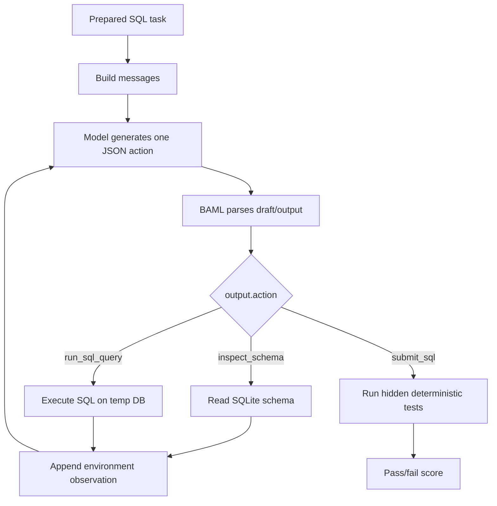

# Distilling A 0.8B SQL Tool-Use Agent

This post is about a very practical question:

> Can we take a tiny model, put it inside a real tool-use harness, and teach it to behave more like a stronger model on one focused task?

That is the version of distillation I care about here. Not just "make the small language model imitate text from the big language model", but "make the small model imitate useful behavior inside the same environment where it will actually run."

For this first post, the environment is SQLite. The model gets a user issue and a buggy SQL query. It can inspect the schema, run SQL, observe results or errors, and finally submit corrected SQL. The score is deterministic: hidden tests run against the database. No LLM user simulator. No LLM judge.


## The Plan

We will build the post around one loop:

1. Prepare a focused SQL-agent benchmark.
2. Run a small baseline student.
3. Run stronger teacher baselines.
4. Keep only successful teacher trajectories.
5. Convert each successful trajectory into supervised fine-tuning rows.
6. Train the 0.8B student with hard-token SFT.
7. Re-run the same eval, then compare nearby student variants under the same harness.

The important constraint is fairness: the baseline student, teachers, trajectory collection, training data, and tuned-student eval all use the same structured harness contract.

## Experiment Cost

I also want the cost accounting to stay visible. The GPT teacher run used my ChatGPT subscription through a local OpenAI-compatible shim, not direct pay-per-token API billing. The student training ran on a rented RunPod GPU server, and the total rented-GPU training cost for this round was about 20 euros.

## What Distillation Means Here

In ordinary supervised fine-tuning, we train on input/output examples:

```text
prompt -> desired answer
```

For an agentic harness, the examples are not just final answers. They are next actions:

```text
conversation so far -> next tool action
```

If the teacher solves a task in three actions, we can produce three training rows:

```text
user issue -> teacher action 1
user issue + action 1 + observation -> teacher action 2
full history before submit -> teacher action 3
```

This is offline hard-token distillation. "Offline" because we generate teacher trajectories first and train later. "Hard-token" because the target is the teacher's actual next tokens, not the full probability distribution over possible tokens. Later posts can use logits/probabilities, on-policy corrections, and RL-style rewards.


## The Benchmark

For the current version of Blog 1, we use [`birdsql/six-gym-sqlite`](https://huggingface.co/datasets/birdsql/six-gym-sqlite).

Each row contains:

- a natural-language user issue
- buggy or incomplete SQL
- a SQLite database template
- optional preprocessing SQL
- hidden test cases
- reference SQL

The model does **not** see the hidden tests or reference SQL. Those are only for scoring.


The prepared split is deterministic:

```text
data/sql_agent_bird_critic/train.jsonl  # written by Notebook 01
data/sql_agent_bird_critic/eval.jsonl   # written by Notebook 01
data/sql_agent_bird_critic/dbs/         # SQLite templates
```

The split is created in the first notebook, not in a hidden preparation script:

```text
1-distilling-a-0-8b-tool-calling-agent/notebooks/01_explore_sql_agent_benchmark.ipynb
```

The split variables are visible in the notebook:

```python
SPLIT_SEED = 42
EVAL_FRACTION = 0.2
TASK_CATEGORY = "Query"
DB_FILTER = ["netflix", "movie_3", "books", "chinook"]
```

The selected split is domain-focused: only `Query` tasks from the selected media/catalog-style databases. We split by percentage inside each database, so eval stays representative of the same domain mix.

```text
netflix
movie_3
books
chinook
```

With the current notebook settings, that gives:

```text
candidate rows: 1099
train rows: 879
eval rows: 220
eval fraction: 0.2 per selected database
```

## The Harness

The model has one action interface:

```json
{"action": "inspect_schema"}
{"action": "run_sql_query", "sql": "SELECT ..."}
{"action": "submit_sql", "sql": ["SQL statement 1", "SQL statement 2"]}
```

The harness runs one action at a time. If the model inspects the schema or runs SQL, the environment appends an observation and asks for the next action. If the model submits SQL, the harness runs the hidden tests and stops.



The core loop is small. The real version lives in `common/sql_agent.py`, but conceptually it is this:

```python
def run_task(row, *, data_dir, generate, max_turns=8):
    messages = initial_messages(row)

    with task_database(row, data_dir) as db_path:
        conn = sqlite3.connect(db_path)
        execute_sql_list(conn, row["preprocess_sql"])

        for turn in range(1, max_turns + 1):
            baml_output = generate(messages)
            draft, action = parse_decision(baml_output)

            if action is None:
                return task_result(row, trace, "parse_failure", False)

            messages.append({"role": "assistant", "content": baml_output})

            if action["action"] == "inspect_schema":
                observation = schema_text(conn)
                messages.append({"role": "user", "content": environment_message(observation)})
                continue

            if action["action"] == "run_sql_query":
                observation = run_sql_observation(conn, action["sql"])
                messages.append({"role": "user", "content": environment_message(json.dumps(observation))})
                continue

            score = evaluate_submitted_sql(row, action["sql"], data_dir)
            return task_result(row, trace, "submitted", score["success"])

        return task_result(row, trace, "max_turns", False)
```

The parser is structural: it expects BAML-style `draft` plus `output`, then validates the action name and argument types. It does not use user-word keyword matching.

```python
def parse_decision(text):
    stripped = strip_model_text(text)
    value = json.loads(stripped)
    draft = value.get("draft")
    output = value.get("output", value)
    return draft, normalize_action(output)
```

## A Real Task

Here is one held-out eval task from the current split:

```text
Task id: TRAIN_2367
Database: chinook
Category: Query

User issue:
I want to find the latest track_id and use that id to filter records in
the track table.

Buggy SQL:
WITH vars AS (SELECT COUNT(*) AS vars_id FROM track)
SELECT * FROM track WHERE track_id = vars_id

Reference SQL, hidden from model:
WITH vars AS (SELECT MAX(track_id) AS vars_id FROM track)
SELECT * FROM track WHERE track_id = (SELECT vars_id FROM vars)
```

The base student starts in the right direction, but gets stuck repeating the same tool action:

```text
Turn 1 parsed action:
{"action": "inspect_schema"}

Environment:
schema text, including table track(track_id, name, ...)

Turn 2 parsed action:
{"action": "inspect_schema"}

Stop reason:
repeated_action
```

The GPT teacher solves it:

```text
Turn 1 parsed action:
{"action":"inspect_schema"}

Turn 2 parsed action:
{"action":"submit_sql","sql":["WITH vars AS (SELECT MAX(track_id) AS vars_id FROM track) SELECT * FROM track WHERE track_id = (SELECT vars_id FROM vars);"]}

Score:
pass
```

The first tuned student also solves this specific task:

```text
Turn 1 parsed action:
{"action": "inspect_schema"}

Turn 2 parsed action:
{"action": "run_sql_query", "sql": "SELECT track_id, name FROM track ORDER BY track_id DESC LIMIT 1;"}

Environment:
{"ok": true, "rows": [[3503, "Koyaanisqatsi"]], "row_count": 1, "truncated": false}

Turn 3 parsed action:
{"action": "submit_sql", "sql": ["SELECT * FROM track WHERE track_id = (SELECT MAX(track_id) FROM track);"]}

Score:
pass
```

This is what we want distillation to do: make the small model produce useful next actions in the harness. But one nice example is not enough. The aggregate score decides.

## Baseline Evals

Base student:

```bash
uv run mlx_lm.server \
  --model mlx-community/Qwen3.5-0.8B-MLX-bf16 \
  --host 127.0.0.1 \
  --port 8091 \
  --chat-template-args '{"enable_thinking": false}'
```

```bash
uv run python 1-distilling-a-0-8b-tool-calling-agent/eval_sql_agent.py \
  --model mlx-community/Qwen3.5-0.8B-MLX-bf16 \
  --base-url http://127.0.0.1:8091/v1 \
  --data-dir data/sql_agent_bird_critic \
  --max-turns 8 \
  --max-new-tokens 1024 \
  --output outputs/qwen3_5_0_8b_mlx_sql_agent_eval.json
```

GPT teacher:

```bash
uv run python 1-distilling-a-0-8b-tool-calling-agent/eval_sql_agent.py \
  --model gpt-5.5 \
  --base-url http://127.0.0.1:8080/v1 \
  --reasoning-effort medium \
  --data-dir data/sql_agent_bird_critic \
  --max-turns 8 \
  --max-new-tokens 2048 \
  --output outputs/gpt_5_5_medium_sql_agent_eval.json
```

Current BAML-harness held-out results:

| Run | Success | Submitted | Parse Failures | Repeated-Action Failures |
| --- | ---: | ---: | ---: | ---: |
| Qwen3.5-0.8B base student | 1/220 = 0.5% | 1 | 11 | 208 |
| Qwen3.5-2B base student | 0/220 = 0.0% | 1 | 0 | 219 |
| GPT 5.5 medium teacher | 115/220 = 52.3% | 220 | 0 | 0 |

This table should only contain results from the current BAML structured-output harness.

The current harness uses BAML for OpenAI-compatible model calls. The model returns one structured decision:

```json
{
  "draft": "Need schema before final SQL.",
  "output": {"action": "inspect_schema"}
}
```

## Generating Teacher Data

For teacher data, we run the teacher on train tasks and keep only successful trajectories:

```bash
uv run python 1-distilling-a-0-8b-tool-calling-agent/generate_sql_teacher_sft_rows.py \
  --model gpt-5.5 \
  --base-url http://127.0.0.1:8080/v1 \
  --reasoning-effort medium \
  --data-dir data/sql_agent_bird_critic \
  --partition train \
  --max-turns 8 \
  --max-new-tokens 2048 \
  --task-timeout-seconds 180 \
  --output outputs/gpt_5_5_medium_sql_agent_train_baml_sft_trace_rows.jsonl
```

Teacher generation must use the current percentage split. A full train run should report `879` attempted train tasks. If it reports `500`, the prepared data is stale.

The teacher script writes BAML-canonical SFT trace rows from successful trajectories. The second notebook then turns those BAML-canonical SFT trace rows into the final SFT file:

```text
1-distilling-a-0-8b-tool-calling-agent/notebooks/02_explore_teacher_sft_data.ipynb
```

That notebook canonicalizes each assistant target:

```python
target = json.dumps(row["teacher_action"], separators=(",", ":"), ensure_ascii=False)
canonical_messages = row["messages"][:-1] + [{"role": "assistant", "content": target}]
```

The important detail is that we only keep rows from trajectories that fully pass the hidden tests. A beautiful-looking intermediate tool call from a failed task is not trusted. The final training target is the canonical next action, not the teacher's non-canonical text, because the harness consumes exactly one JSON action per turn.

## Training

The training path is one Unsloth-style script: MLX-Tune for small local experiments on this Mac, core Unsloth for the final NVIDIA runs.

```text
student models: unsloth/Qwen3.5-0.8B and unsloth/Qwen3.5-2B
source rows: 1046
kept rows at 4096 tokens: 1042
train/validation rows: 990/52
max_seq_length: 4096
batch_size: 1
gradient_accumulation_steps: 8
learning_rate: 5e-5
lora_rank: 32
lora_alpha: 32
optimizer steps: 372
```

On this Mac, the same Unsloth-style script can import MLX-Tune for smaller smoke runs:

```bash
uv pip install mlx-tune

uv run python 1-distilling-a-0-8b-tool-calling-agent/train_unsloth.py \
  --train-path outputs/gpt_5_5_medium_sql_agent_train_sft_canonical_3072.jsonl \
  --output-dir outputs/qwen3_5_0_8b_mlx_tune_sql_agent_gpt_teacher_sft_3072 \
  --learning-rate 1e-4
```

Later, the same script can move to CUDA by switching the backend and model:

```bash
uv pip install unsloth

uv run python 1-distilling-a-0-8b-tool-calling-agent/train_unsloth.py \
  --backend cuda \
  --model unsloth/Qwen3.5-2B \
  --train-path outputs/gpt_5_5_medium_sql_agent_train_frozen_current.jsonl \
  --output-dir outputs/qwen3_5_2b_sql_agent_sft_cuda_gpt55_1046rows_4096_3epoch_lr5e-5_r32 \
  --max-seq-length 4096 \
  --batch-size 1 \
  --grad-accum 8 \
  --learning-rate 5e-5 \
  --lora-rank 32 \
  --lora-alpha 32 \
  --max-steps 372
```

The core code shape stays the same:

```python
from mlx_tune import FastLanguageModel, SFTConfig, SFTTrainer, train_on_responses_only

model, tokenizer = FastLanguageModel.from_pretrained(
    model_name="mlx-community/Qwen3.5-0.8B-MLX-bf16",
    max_seq_length=3072,
)
model = FastLanguageModel.get_peft_model(model, r=16, lora_alpha=16)
trainer = SFTTrainer(model=model, tokenizer=tokenizer, train_dataset=train_rows, args=SFTConfig(max_seq_length=3072))
trainer = train_on_responses_only(trainer, response_part="<|im_start|>assistant\n")
trainer.train()
```

This is not a parser trick or a benchmark-specific workaround. It is a portability choice: MLX-Tune on the Mac, core Unsloth on NVIDIA, one training script.

## Tuned Student Eval

The tuned model is evaluated through the same deterministic SQL-agent harness. For OpenAI-compatible serving, the harness can call `eval_sql_agent.py`. For the CUDA LoRA adapters in this post, I evaluated the saved HF/PEFT adapter directly on the GPU machine:

```bash
python 1-distilling-a-0-8b-tool-calling-agent/eval_sql_agent_local.py \
  --model unsloth/Qwen3.5-0.8B \
  --adapter-path outputs/qwen3_5_0_8b_sql_agent_sft_cuda_gpt55_1046rows_4096_3epoch_lr5e-5_r32/adapter \
  --data-dir data/sql_agent_bird_critic \
  --partition eval \
  --max-seq-length 8192 \
  --max-turns 8 \
  --max-new-tokens 512 \
  --task-timeout-seconds 180 \
  --temperature 0.0 \
  --dtype bf16 \
  --output outputs/qwen3_5_0_8b_sql_agent_sft_cuda_gpt55_1046rows_4096_3epoch_lr5e-5_r32_eval.json
```

Result:

| Run | Success | Submitted | Parse Failures | Repeated-Action Failures |
| --- | ---: | ---: | ---: | ---: |
| Qwen3.5-0.8B base | 1/220 = 0.5% | 1 | 11 | 208 |
| Qwen3.5-0.8B SFT, 1046 rows, 4096 context, r32 | 44/220 = 20.0% | 204 | 6 | 10 |
| Qwen3.5-0.8B SFT, submit rows duplicated once | 38/220 = 17.3% | 199 | 9 | 11 |
| Qwen3.5-2B base | 0/220 = 0.0% | 1 | 0 | 219 |
| Qwen3.5-2B SFT, 1046 rows, 4096 context, r32 | 57/220 = 25.9% | 206 | 5 | 9 |
| LFM2.5-8B-A1B SFT, 1046 rows, 4096 context, r32 | 47/220 = 21.4% | 186 | 7 | 27 |
| GPT 5.5 medium teacher | 115/220 = 52.3% | 220 | 0 | 0 |

The tuned students clearly learned the harness: they stopped repeating the same action and started submitting SQL. But the best student is still far from the teacher. On the final 1046-row frozen data, Qwen3.5-2B is the strongest student, while LFM2.5-8B-A1B does not beat it on this harness.

The 0.8B improvement attempt was a clean negative result. I duplicated final `submit_sql` rows once, hoping to put more weight on final answer supervision. It made the 0.8B model worse: 38/220 instead of 44/220. It lost 17 tasks that the current 1046-row 0.8B adapter solved, gained 11 new solved tasks, and increased SQL execution errors. So the issue is not simply "make the model submit more." The small model needs better SQL decisions, not just more final-action pressure.

The final adapters, eval JSONs, and frozen SFT data for this round are now mirrored back to the local repo under `outputs/remote_training_artifacts/`, `outputs/remote_eval_results/`, and `outputs/gpt_5_5_medium_sql_agent_train_frozen_current.jsonl`. Those paths are ignored artifacts, not source files, but they make the numbers in this post reproducible from the same Mac checkout.

The result says three concrete things:

- SFT fixed a real harness-control problem: the tuned students submit SQL instead of looping.
- Lower validation loss did not guarantee better task success.
- Reweighting the final `submit_sql` action shifted behavior, but did not improve SQL correctness.

## What We Learned

The pipeline is now real:

```text
teacher -> harness -> passing trajectories -> SFT rows -> LoRA -> same eval
```

The result should be interpreted only inside this fixed BAML harness. The environment and benchmark stay unchanged, so the comparison is about the training data, model choice, and optimization recipe rather than a moving evaluation target.

## Where The Series Goes Next

This post is hard-token offline distillation. The next posts can keep the same harness and change the learning signal:

- **Blog 2:** soft-label/logit distillation on teacher actions
- **Blog 3:** on-policy distillation from student rollouts and teacher corrections
- **Blog 4:** RL/GRPO-style training with SQLite test success as reward

The harness stays central. The model is only one part of the system.
