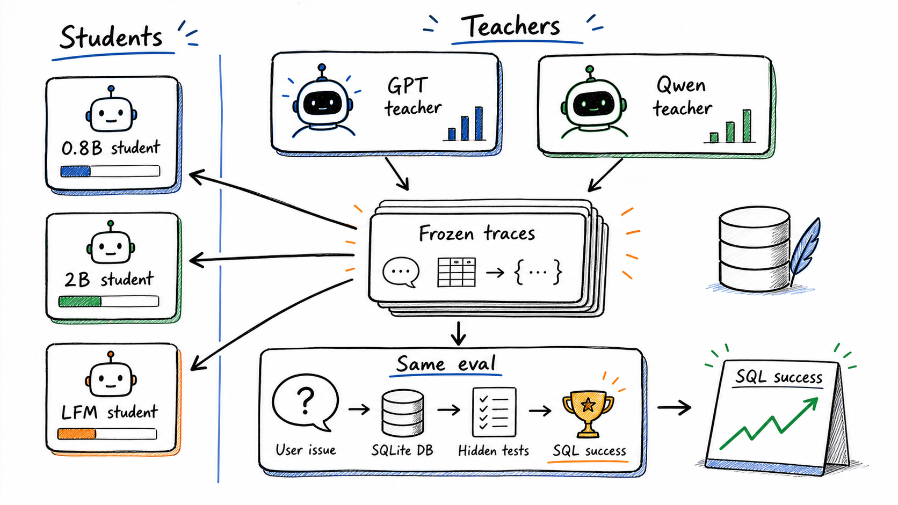
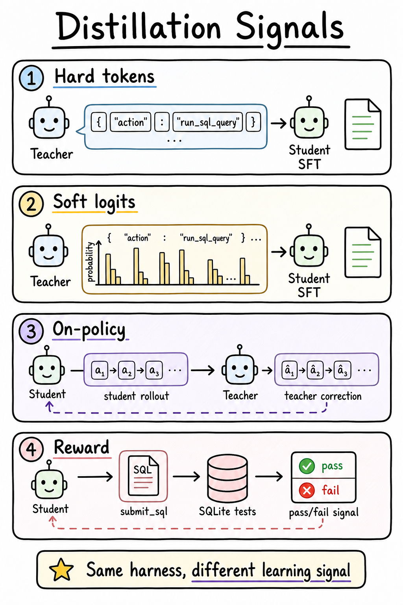
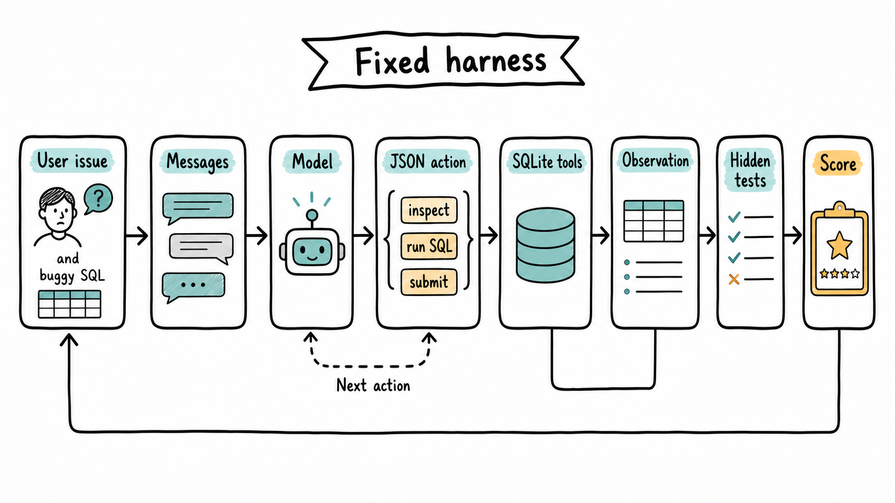
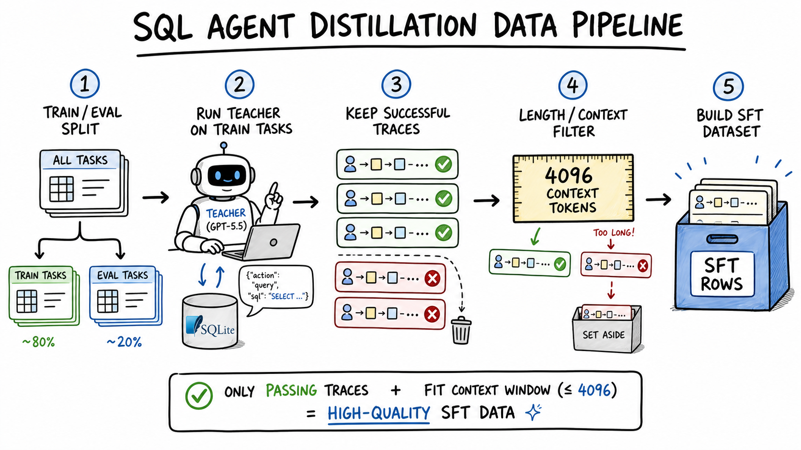
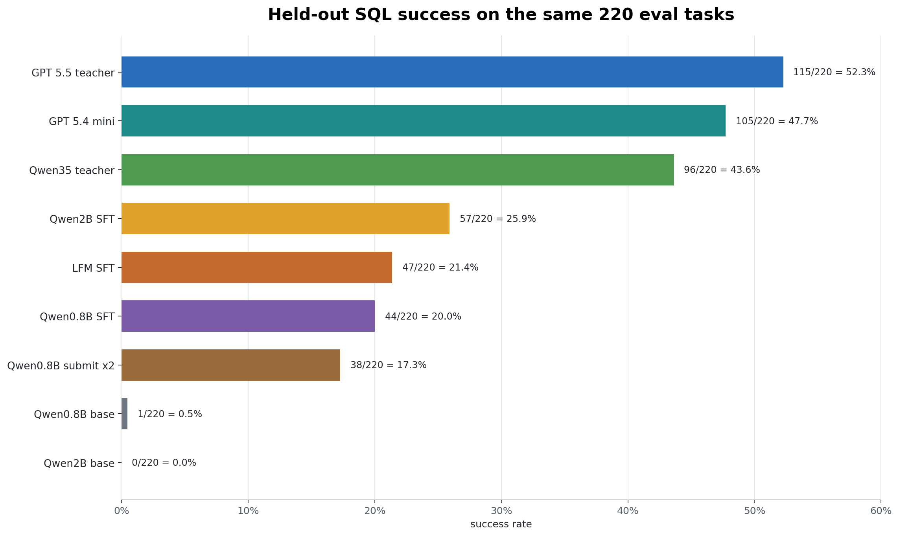
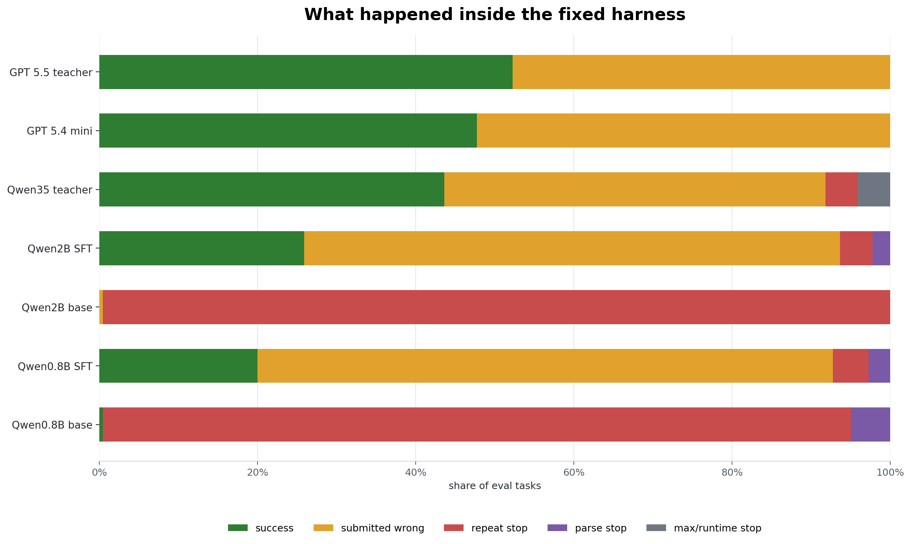
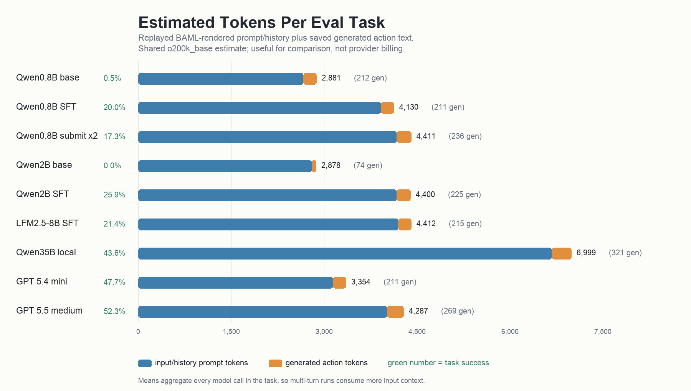

# Distilling A 0.8B SQL Tool-Use Agent

I started this experiment with a very specific question:

> Can a tiny model learn to act like a stronger model inside a real tool-use loop?

Not "can it write SQL-looking text?" Not "can it pass a prompt demo?" I wanted the small model to sit inside the same harness as the teacher, inspect a database, run SQL, read observations, and submit a final answer that passes deterministic hidden tests.

That distinction is the whole post.

If I ask a model to answer a SQL question in plain text, I can get something that looks plausible. It may even look beautiful in a notebook. But a real SQL repair agent has to do more than produce plausible text. It has to follow an interface. It has to choose when to inspect the schema. It has to decide when a query is worth testing. It has to read the result of that query and decide whether it is enough. At the end, it has to submit SQL that actually passes tests.

So the thing I wanted to distill was not only knowledge about SQL. I wanted to distill a behavior pattern:

```text
read the task
inspect what is unknown
run a useful query
interpret the observation
submit when ready
```

That is a different object than a single answer.

This post is the first version of that experiment. I kept the benchmark fixed, kept the environment fixed, and changed only the model/training side. The commands, exact paths, and runnable reproduction details live in the README. Here I want to tell the technical story: what distillation means, what kind of distillation I used, how the harness works, how the teacher traces became training rows, which students I tried, and what the held-out eval actually said.



## The Shape Of The Experiment

The end-to-end loop is simple to describe:

```text
strong teacher runs the SQL harness
  -> keep only successful trajectories
  -> convert each teacher action into SFT rows
  -> train a smaller student model
  -> rerun the same held-out eval
```

The difficult part is making each word in that loop mean something precise.

"Successful" means hidden SQLite tests passed. Not an LLM judge. Not a visual inspection. Not "the SQL looked right." The submitted SQL had to pass deterministic checks.

"Trajectory" means the whole action sequence, not only the final answer. If a teacher inspects schema, runs a query, and then submits SQL, that gives three decision points. Each decision point can teach the student what to do given the conversation state up to that moment.

"Same eval" means the base models, teacher candidates, fine-tuned students, and negative experiments all used the same 220 held-out tasks and the same harness contract. I did not change the benchmark to make a number look better.

That last point matters because small agent experiments are easy to fool yourself with. A small parser tweak, a looser stop condition, or a different test split can change the number. I wanted the comparison to mean: this model behaved differently under the same measurement.

## Distillation, Plainly

Knowledge distillation is the idea that a stronger teacher model can transfer useful behavior into a smaller student model.

The simplest mental model is:

```text
teacher knows how to do the task
student is cheaper/smaller/faster
train student to imitate teacher
```

That is true, but it hides the main design choice: **what exactly does the student imitate?**

There are several different answers.

| Distillation signal | What the student sees | What it teaches |
| --- | --- | --- |
| Hard labels | The teacher's chosen output tokens | "Produce this answer." |
| Soft labels / logits | The teacher's probability distribution over tokens | "Prefer this answer, but also learn the teacher's uncertainty." |
| Hidden states | Internal activations from a teacher network | "Match part of the teacher's representation." |
| Final answers | Only the teacher's completed response | "Imitate the outcome." |
| Trajectories | Intermediate actions, observations, and final answers | "Imitate the process." |
| Rewards | A pass/fail or scalar score after acting | "Search for behavior that scores well." |

These are often mixed together in real systems, but separating them helps explain what this post is and is not doing.

### Hard-Label Distillation

Hard-label distillation is the most familiar version. The teacher produces an answer, and the student is trained on that answer as the target.

For a normal chat task, it looks like:

```text
input:  explain why the sky is blue
target: the teacher's answer
```

During supervised fine-tuning, the student is trained to put probability mass on the exact target tokens. The target is "hard" because we only keep the teacher's selected tokens. We do not train on the teacher's full distribution over possible next tokens.

This is simple, scalable, and works well when the teacher output is high quality. It is also lossy. The teacher may have considered many possible continuations, but the student only sees the one that was sampled or decoded.

### Soft-Label Or Logit Distillation

Soft-label distillation keeps more information. Instead of only telling the student "the next token is X," we tell it something like "the teacher assigned 62% probability to X, 20% to Y, 8% to Z, and tiny mass elsewhere."

That can teach the student the teacher's uncertainty. If two tokens are both reasonable, the student can learn that. If one answer is correct but another is almost correct, the teacher's distribution may encode that relationship.

For language models, this usually requires a scoring path that exposes token probabilities. A normal chat-completions API may not give enough of that information. You need a serving path or direct model forward pass that can score the target under the teacher.

That is not what this post does. This post uses hard teacher actions, not logits.

### Feature Or Representation Distillation

Feature distillation tries to make the student match internal representations of the teacher. This is common in some vision and speech setups, and it can be used for language models too, but it is a more invasive training setup. It usually assumes access to internals and some architecture-aware alignment between teacher and student.

That is also not what this post does.

### Final-Answer Distillation

Final-answer distillation is what people often mean when they say "use a big model to generate training data." The teacher solves a task and we keep the final answer.

For SQL repair, that would mean:

```text
user issue + buggy SQL -> corrected SQL
```

That can be useful. But it throws away the process. In a tool-use environment, the process is part of the product. The student must learn when to use tools and how to react to observations. A final SQL string does not teach the student how to decide between `inspect_schema`, `run_sql_query`, and `submit_sql` at each turn.

### Trajectory Distillation

Trajectory distillation keeps the teacher's steps.

For this harness, a successful teacher run might look like:

```text
turn 1: inspect_schema
observation: database schema
turn 2: run_sql_query
observation: rows or SQL error
turn 3: submit_sql
score: pass
```

That single task can become several supervised examples:

```text
conversation before turn 1 -> teacher action at turn 1
conversation before turn 2 -> teacher action at turn 2
conversation before turn 3 -> teacher action at turn 3
```

This is the kind of distillation I used here.

### Reward-Based Distillation And RL

Reward-based methods do not necessarily ask the student to imitate a teacher action. They ask the student to act, score the outcome, and update toward behavior that scores better.

For this SQL task, the reward is natural: did the submitted SQL pass the hidden tests?

That is a powerful direction, but it is not this post. This first post is deliberately simpler: collect successful teacher trajectories, train on the teacher's next actions, and evaluate under the same harness.

## The Kind Of Distillation In This Post

This blog uses **offline hard-token trajectory distillation**.

That phrase is a mouthful, so here is what each part means.

**Offline** means the teacher is not in the training loop. I ran the teacher first, saved traces, filtered them, and trained later. The student is not asking the teacher for help while it is being optimized.

**Hard-token** means the student trains on the teacher's chosen action tokens. It does not see teacher logits or probabilities.

**Trajectory** means the training data includes intermediate actions, not only final SQL.



For an ordinary chat task, a training row might be:

```text
prompt -> answer
```

For this agent task, the row is:

```text
conversation so far -> next structured action
```

That one change makes the experiment feel more like training a small policy than training a normal answer generator. The policy is still a language model. It still predicts tokens. But the tokens are executable decisions inside a deterministic environment.

## Why A SQL Tool-Use Agent?

I wanted a task with four properties.

First, it needed a real environment. If the model can inspect schema and execute SQL, then tool use is not decorative. The environment can change what the model should do next.

Second, it needed deterministic scoring. I did not want to build a post around an LLM judge. Hidden SQL tests are much cleaner. The model either submits SQL that passes or it does not.

Third, it needed to be small enough to iterate. A huge benchmark would make every teacher run, training run, and eval run expensive. A narrow split lets me debug the pipeline and understand failures.

Fourth, it needed to be hard enough that the base tiny model fails. If the 0.8B model already solved the task, distillation would be less interesting. I wanted a real gap between base student and teacher.

SQL repair fits that shape. The model receives a user issue and buggy SQL. It can inspect the SQLite schema, run queries, and submit corrected SQL. The hidden tests decide whether the answer is correct.

## The Fixed World

The benchmark is [`birdsql/six-gym-sqlite`](https://huggingface.co/datasets/birdsql/six-gym-sqlite). Each task contains:

| Field | Role in the harness |
| --- | --- |
| User issue | Natural-language description of what is wrong or desired |
| Buggy SQL | The user's incomplete or incorrect starting point |
| SQLite database template | The database the model can inspect and query |
| Preprocessing SQL | Setup applied before the task, when needed |
| Hidden tests | Deterministic scoring checks, hidden from the model |
| Reference SQL | A known solution, hidden from the model |

The model does not see the hidden tests or the reference SQL. It only sees the user issue, the buggy SQL, and the observations produced by its own tool calls.


For this post I narrowed the task distribution instead of trying to cover the whole dataset at once:

| Setting | Value |
| --- | --- |
| Task category | `Query` |
| Databases | `netflix`, `movie_3`, `books`, `chinook` |
| Source rows scanned | 5000 |
| Candidate rows after filtering | 1099 |
| Train split | 879 tasks |
| Eval split | 220 tasks |
| Split seed | 42 |

The database mix is intentionally ordinary: media catalogs, books, movies, and a Chinook-style music store. That keeps the post focused on the agent-distillation question rather than on an extremely broad SQL distribution.

This is not meant to be the final word on SQL agents. It is a controlled sandbox where the teacher, student, and eval can all be compared cleanly.

## What The Harness Actually Does

The harness gives the model exactly three possible actions:

```json
{"action": "inspect_schema"}
{"action": "run_sql_query", "sql": "SELECT ..."}
{"action": "submit_sql", "sql": ["SQL statement 1", "SQL statement 2"]}
```

That is the contract. Every model has to live inside it.

The loop is:

```text
build messages from task
ask model for one structured action
parse the action
execute the action
append an observation if the task is not done
repeat until submit, failure, or max turns
```

If the model chooses `inspect_schema`, the harness returns schema text for the SQLite database. If the model chooses `run_sql_query`, the harness executes that query against a task-local database and returns rows or an error. If the model chooses `submit_sql`, the harness runs the hidden tests and records pass/fail.



There is no conversation with a fake user. There is no LLM grader. The environment is SQLite plus a deterministic evaluator.

That makes the failure modes meaningful.

| Stop reason | What it means |
| --- | --- |
| `submitted` | The model submitted final SQL; the SQL either passed or failed hidden tests |
| `parse_failure` | The model did not produce a valid structured action |
| `repeated_action` | The model repeated an action that the harness considered unproductive |
| `max_turns` | The model kept acting but never reached a valid final submission |
| `runtime_error` | The model call or harness call failed during the task |

These are not just logging details. They tell us what kind of problem the model has.

A base model that repeats `inspect_schema` forever has a different failure from a model that submits syntactically valid SQL that fails a hidden test. The first model has not learned the tool-use loop. The second model can drive the loop but is making wrong SQL decisions.

That distinction became one of the main results.

## Why Structured Actions Matter

For tool-use agents, formatting is not superficial. The model can have the right idea and still fail if the harness cannot execute its action.

A human can read:

```text
I should inspect the schema first.
```

But the harness needs:

```json
{"action":"inspect_schema"}
```

The target format is intentionally narrow because the environment needs executable actions. This is also why the training target is canonical JSON. I do not train on long teacher prose when the environment only accepts one action.

The important thing is that this is not a keyword trick. The harness is not searching for words like "schema" or "submit" in the model output. It expects a structured action, normalizes it, validates the action name and argument types, and then executes the result.

That is the kind of interface a real tool-use model has to learn.

## The Runtime Architecture

The system has five pieces:

```text
dataset split
  -> SQL harness
  -> model serving path
  -> teacher trace / eval output
  -> student training path
```

Each piece has a specific job.

The **dataset split** defines the fixed train/eval world. It controls which tasks are used for teacher trace generation and which tasks are held out for evaluation.

The **SQL harness** owns the environment. It builds the prompt, parses the action, runs SQLite tools, appends observations, and scores submitted SQL.

The **model serving path** lets different models plug into the same harness. Some models are served locally with MLX. GPT models go through a local ChatGPT subscription shim with an OpenAI-compatible interface. CUDA adapter evals can run directly in-process on the GPU machine or through an OpenAI-compatible server.

The **teacher trace output** stores successful trajectories and eval results. It is the bridge between inference and training.

The **student training path** fine-tunes small models with LoRA on the canonical teacher-action rows.

That separation is why I could compare a GPT teacher, a hosted GPT 5.4 mini baseline, a local Qwen35 teacher candidate, base Qwen students, fine-tuned Qwen students, and an LFM student under the same harness.

## The Environment

There were two main machines involved.

| Machine | What it did |
| --- | --- |
| Mac | Dataset work, notebooks, MLX serving/eval, ChatGPT shim evals, blog artifacts |
| NVIDIA GPU server | CUDA LoRA training and some direct HF/PEFT evals |

The Mac side is convenient for local iteration. I can run the harness, serve MLX models that fit, call the ChatGPT shim, inspect outputs, generate charts, and update the blog.

The GPU server is for training. The final student runs used CUDA because LoRA training on these models is much faster there. After training, the adapter artifacts and eval JSONs were synced back into the local checkout under ignored `outputs/` folders.

That means the blog and source-facing assets can be updated locally without keeping the remote GPU machine alive. The remote machine is only needed when I want to launch another CUDA training run or a GPU-only eval.

## Teacher And Student Models

I used the word "teacher" in two slightly different ways.

The GPT model is the actual teacher for the SFT data in this post. Its successful train trajectories became the student training rows.

The local Qwen35 run is a teacher candidate / strong baseline. It helps answer a different question: if I run a much larger Qwen-family model in the same harness, where does it land compared with the GPT teacher and the fine-tuned students?

The model set:

| Role | Models |
| --- | --- |
| Main teacher for SFT data | GPT 5.5 medium |
| Hosted smaller-model baseline | GPT 5.4 mini |
| Strong local teacher candidate | Qwen3.5-35B-A3B 8-bit |
| Main tiny student | Qwen3.5-0.8B |
| Same-family larger student | Qwen3.5-2B |
| Sparse / expert-style student comparison | LFM2.5-8B-A1B |

I started with Qwen3.5-0.8B because the premise of the post is small-model distillation. A 0.8B model is small enough that a win would matter. If it can learn a useful tool-use loop, that is interesting.

I added Qwen3.5-2B because a same-family larger student gives a useful scale comparison. If 2B improves much more than 0.8B, the bottleneck may simply be capacity.

I added LFM2.5-8B-A1B because a sparse/expert-style model is an interesting comparison. It is larger in one sense, but not equivalent to a dense Qwen. The question was whether it would dominate this harness. It did not.

I added GPT 5.4 mini because it is the practical hosted-small-model baseline. If a smaller hosted model already beats the local distilled students and the local Qwen35 candidate, that is important context for what the distillation work has and has not achieved.

I added Qwen3.5-35B-A3B 8-bit because it gives a stronger local reference point. It is not the source of the SFT rows in this run, but it tells us how a much stronger Qwen-family model behaves under the same measurement.

## Teacher Trace Generation

The GPT teacher was run on the 879 train tasks. It solved 446 of them:

```text
teacher train success: 446/879 = 50.7%
submitted: 879/879
parse failures: 0
repeated-action failures: 0
average turns: 2.57
```

The key choice was to keep only successful trajectories.

That means if the teacher failed a task, I did not train the student on the teacher's intermediate actions from that task. A failed trace may still contain locally reasonable steps, but I do not want to teach the student from a trajectory that ended in wrong SQL.

Only successful trajectories were trusted.


Those 446 successful tasks became 1046 canonical SFT rows.

Why more rows than tasks? Because a task can have multiple turns. If the teacher solved a task with three actions, that one task can produce three next-action training examples.

For example:

```text
row 1 input:
  system prompt + user issue
row 1 target:
  inspect_schema

row 2 input:
  system prompt + user issue + inspect_schema + schema observation
row 2 target:
  run_sql_query

row 3 input:
  full history before final answer
row 3 target:
  submit_sql
```

This is where agent distillation differs from final-answer distillation. The student is not only learning what the final SQL should look like. It is learning which action to take at each state.

## Canonical Targets

One subtle but important part of the pipeline is canonicalization.

The teacher may return a structured object through BAML with a draft and output. The harness only needs the executable action. The training target is therefore the canonical action JSON.

For a final answer, the target might be:

```json
{"action":"submit_sql","sql":["SELECT * FROM track WHERE track_id = (SELECT MAX(track_id) FROM track);"]}
```

The student is not trained to reproduce hidden evaluator data. It is not trained on the reference SQL directly. It is trained to reproduce the teacher's next executable action in the conversation state.

That target choice keeps the learning problem aligned with the runtime problem.

At runtime, the student has to emit one executable action. During training, it sees one executable action.

## Data And Configuration Decisions

This is the section I wish every distillation post had, because a lot of the result lives in these choices: what counted as input length, what was filtered out, how much output the model could generate, how many turns it got, and which teacher rows were trusted.



First, the benchmark split. I used a fixed seed and a fixed database/task filter before generating teacher data or training students:

| Database | Candidate tasks | Train tasks | Eval tasks |
| --- | ---: | ---: | ---: |
| `books` | 282 | 226 | 56 |
| `chinook` | 251 | 201 | 50 |
| `movie_3` | 273 | 218 | 55 |
| `netflix` | 293 | 234 | 59 |
| **Total** | **1099** | **879** | **220** |

The teacher trace run used the 879 train tasks. GPT 5.5 medium submitted on all 879, solved 446, produced 2262 parsed actions across the run, and averaged 2.57 turns per task. Only the 446 successful trajectories were used for SFT. Those successful trajectories became 1046 source SFT rows, which is about 2.35 next-action rows per successful task.

The length filter is easy to misunderstand. I did **not** filter only by the length of the target JSON action. I filtered by the full rendered training sequence: system message, user task, prior assistant actions, environment observations, and the canonical assistant target for that row. In other words, the token count is the whole chat example the student sees during SFT, not just the output. These filter numbers are training-tokenizer counts from the Qwen SFT path.

| SFT data statistic | Value |
| --- | ---: |
| Source rows from successful teacher trajectories | 1046 |
| Rows kept at `max_seq_length=4096` | 1042 |
| Rows dropped for being too long | 4 |
| Token length min / P50 / P90 / P95 | 605 / 1786 / 2948 / 3208 |
| Longest source row before filtering | 15836 tokens |
| Final train / validation rows | 990 / 52 |

I chose 4096 tokens for training because almost all rows fit while keeping the run practical on the rented GPU. The few over-length rows were usually long because tool-use histories can include large schema observations or multi-turn context. Keeping them would require a longer training context for very little extra data.

For reporting, I also split the SFT rows into prompt/history tokens and target/action tokens with a shared tokenizer estimate. That answers a slightly different question: how much of each row is context, and how much is the assistant action the student learns to generate?

| SFT row token estimate | Mean | P50 | P90 | P95 |
| --- | ---: | ---: | ---: | ---: |
| Prompt/history before target | 1527 | 1533 | 2555 | 2743 |
| Target action JSON | 90 | 69 | 192 | 259 |
| Prompt plus target | 1617 | 1633 | 2704 | 2934 |

The important shape is obvious: the target is short, while the context can be long. The student is mostly learning to emit a compact action after reading a growing task state.

For eval, I gave the local HF/PEFT student path a larger input window than training: `max_seq_length=8192`. That is the maximum rendered conversation context the local evaluator allows before generation. It helps avoid cutting off long schema/tool histories during rollout. The generated output budget was separate: `max_new_tokens=512` for the local student/base evals. So "context length" means the input/history budget, while "max new tokens" means the maximum assistant action text the model may generate on one turn.

| Run family | Input/history budget | Output budget per turn | Max turns | Timeout | Temperature |
| --- | ---: | ---: | ---: | ---: | ---: |
| CUDA local HF/PEFT students and bases | 8192 tokens | 512 new tokens | 8 | 180s/task | 0.0 |
| GPT 5.5 medium teacher eval | server/model context via shim | 1024 new tokens | 8 | 180s/task | 0.0 |
| GPT 5.4 mini hosted eval | server/model context via shim | 2048 new tokens | 8 | 180s/task | 0.0 |
| Qwen3.5-35B-A3B 8-bit MLX eval | MLX server context | 2048 new tokens | 8 | 180s/task | 0.0 |

The GPT and Qwen35 paths are OpenAI-compatible HTTP paths, so the saved eval configs record `max_new_tokens` and turn/time limits, while the server/model owns the exact prompt-context capacity. The student HF/PEFT path records an explicit `max_seq_length=8192` because it renders and runs the model locally.

The student training setup was LoRA SFT on the canonical assistant action only:

| Training setting | Value |
| --- | ---: |
| Backend | CUDA / Unsloth-style SFT |
| Epochs / optimizer updates | 3 / 372 |
| Batch size / grad accumulation / effective batch | 1 / 8 / 8 |
| Learning rate | 5e-5 |
| LoRA rank / alpha | 32 / 32 |
| Target modules | attention projections plus MLP up/down/gate projections |
| Precision | bf16, 16-bit LoRA, not 4-bit |
| Qwen3.5-0.8B trained parameters | 12.78M of 865.77M, about 1.48% |

The selection rule was deliberately simple: train only on canonical next actions from successful teacher trajectories that fit the 4096-token full-example limit. I did not include failed teacher trajectories, did not train on hidden tests or reference SQL, and did not train on the teacher's free-form prose. The target is the action the harness can execute.

Conceptually, every kept row says:

```text
full conversation state before the teacher action -> canonical next action
```

That is the unit of data in this post.

## A Concrete Held-Out Task

Here is the kind of task the model sees on eval:

```text
Database: chinook

User issue:
I want to find the latest track_id and use that id to filter records
in the track table.

Buggy SQL:
WITH vars AS (SELECT COUNT(*) AS vars_id FROM track)
SELECT * FROM track WHERE track_id = vars_id
```

The bug is subtle but common: `COUNT(*)` is not the latest id. The intended shape is to use `MAX(track_id)`.

A weak model can fail this before it even reaches the SQL reasoning. It may inspect the schema, then inspect again, then repeat itself until the harness stops. That is not a SQL error. That is a tool-use control error.

A better model can drive the harness but still submit the wrong SQL. That is a SQL decision error.

A successful model has to do both:

```text
use the harness correctly
choose the right SQL repair
```

This distinction is why I care about the stop-reason breakdown in the results.

## Walking Through A Trace

It helps to slow down and look at what one successful trajectory means as data.

At the beginning of a task, the model has only the system instructions, the database id, the user issue, and the buggy SQL. It does not know whether the table names in the buggy query are real. It does not know whether a column is called `track_id`, `id`, `TrackId`, or something else. It does not know whether the SQL dialect detail will matter. So the first decision is often not "write the final SQL." The first decision is "get the schema."

That is why a teacher trace often starts with:

```json
{"action":"inspect_schema"}
```

The observation after that action is long but useful. It tells the model the real tables, columns, keys, and sometimes enough relationships to repair the query.

Now the model has a choice. If the repair is obvious, it can submit. If it is not obvious, it can run a small diagnostic query. For the "latest track id" example, a useful diagnostic query is not the final answer. It is a quick check:

```text
show the largest track_id
```

That kind of query is valuable because it lets the model test its interpretation before submitting. If the observation confirms that `MAX(track_id)` is the right idea, the model can then submit the final SQL.

The important part for distillation is that each of these states becomes a different supervised example.

The row before schema inspection teaches:

```text
When you do not know the schema, inspect it.
```

The row before the diagnostic query teaches:

```text
When you know the schema but want evidence, run a focused query.
```

The row before final submission teaches:

```text
When the context is enough, stop exploring and submit.
```

These are different lessons. If I trained only on final SQL, the student would not see the decision boundary between inspection, exploration, and final answer.

That is why trajectory rows are valuable for tool-use models. They teach the shape of acting, not just the shape of answers.

## Why The Same Task Can Produce Good And Bad Training Rows

One subtle issue in agent data is that an intermediate action can look good even in a failed trajectory.

Imagine the teacher does this:

```text
inspect_schema -> good
run_sql_query -> good
submit_sql -> wrong
```

Should I keep the first two actions as training rows?

For this post, I chose not to. I only kept rows from trajectories where the whole task passed.

That is conservative. It throws away some potentially useful local actions. But it keeps the meaning of the dataset simple: every row comes from a teacher run that completed the task successfully. If the student imitates that sequence, it is imitating a path that reached a passing submission.

This matters because tool-use data has credit-assignment traps. A diagnostic query might be locally reasonable but part of a bad plan. A final SQL submission might pass for the wrong reason on a tiny visible sample but fail hidden tests. A teacher might inspect schema correctly and still misunderstand the user issue later.

By filtering at the trajectory level, I avoided training on partial behavior from failed runs. It is not the only possible choice, but it is a clean first-post choice.

## Metrics I Care About

The headline metric is held-out task success:

```text
success / total eval tasks
```

That is the number that tells us whether the submitted SQL passed hidden tests.

But for agent distillation, the headline number is not enough. I also track:

| Metric | Why it matters |
| --- | --- |
| Submitted | Did the model reach a final answer at all? |
| Parse stops | Did the model fail the structured action contract? |
| Repeat stops | Did the model get stuck doing the same thing? |
| Max-turn/runtime stops | Did the model keep going too long or hit execution problems? |
| SQL execution errors | Did submitted or tested SQL fail at execution time? |
| Average turns | How much interaction did the model use before stopping? |
| Input and generated tokens | How much context and output did the model spend to get that result? |

These metrics separate interface learning from task learning.

Suppose a model improves from 0% to 20% success. That sounds good, but the reason matters. If it improves because the parser got looser, that is not the same as better agent behavior. If it improves because the model now submits instead of looping, that is a real control improvement. If it already submitted often and success improved, that suggests better task competence.

In this run, the big change after SFT was submission behavior. The base Qwen students almost never submitted. The fine-tuned students submitted on most tasks. That is why I say the first transfer was tool-use rhythm.

The remaining gap appears after submission. The tuned students often submit SQL that is executable but wrong under hidden tests. That is a different problem.

## Why SQL Makes This Hard

SQL looks easy in examples and becomes tricky in evaluation.

A model can produce a query that looks right but is off by one grouping level. It can use `COUNT(*)` when the task requires `MAX(id)`. It can join through the wrong relationship. It can filter before aggregating instead of after. It can preserve the user's buggy query structure too faithfully. It can submit SQLite that would work in another dialect but not here.

The hidden tests catch those mistakes. That is why this is a better eval than asking whether the SQL "looks plausible."

There is also a second difficulty: the buggy SQL is both useful and dangerous.

It is useful because it tells the model what the user tried. It often points to the right tables and columns. It gives a starting hypothesis.

It is dangerous because it can anchor the model to the wrong operation. In the latest-track example, the buggy SQL uses `COUNT(*)`. A model that copies the surface form may keep `COUNT(*)` even though the user needs the maximum id.

So the agent has to treat the buggy SQL as evidence, not truth.

This is exactly the kind of behavior a small model may struggle with. It has to read the user issue, inspect the schema, understand the bug, and decide how much of the original SQL to preserve.

## Model-By-Model Notes

The base Qwen3.5-0.8B result is the clearest failure case. It solved 1 task and submitted once. The model could sometimes produce a structured action, but it did not reliably progress through the harness. This is the "not yet an agent" baseline.

The fine-tuned Qwen3.5-0.8B result is the clearest proof of transfer. It solved 44 tasks and submitted 204 times. That means the model learned a large part of the interaction protocol. It still made many wrong SQL decisions, but it was now participating in the environment.

The submit-duplicated Qwen3.5-0.8B run is the clean negative result. It did not fail because the model refused to submit. It failed because pushing harder on final-answer rows did not improve final-answer quality. That is a useful distinction.

The base Qwen3.5-2B result was surprising in the same way as the 0.8B base result. A larger base model did not automatically know how to use this harness. It still almost never submitted.

The fine-tuned Qwen3.5-2B result was the best student result in this round. Same-family scale helped. But the score was still far below the teacher candidates, which means the remaining gap is not just "use any model above 2B."

The LFM2.5-8B-A1B result is useful because it prevents an overly simple size story. It did not beat the Qwen3.5-2B student here. Architecture, tokenizer behavior, training dynamics, and harness fit all matter.

The Qwen3.5-35B-A3B 8-bit run gives a stronger local reference. It shows that a much stronger Qwen-family model can do far better in the same harness, but it still trails GPT 5.5 medium. That makes the teacher gap more nuanced than "local open model versus proprietary model."

The GPT 5.4 mini run is the hosted small-model reference. It solved 105 out of 220 tasks, submitted on all tasks, and had no parse, repeat, max-turn, or runtime stops. That makes it stronger than the local Qwen35 run in this eval, but still below GPT 5.5 medium.

The GPT 5.5 medium run is the strongest measured result in the post so far. It also generated the successful training traces. It is not perfect, but it is the cleanest teacher we used for this first round.

## Artifact Provenance

One practical lesson from this project is that benchmark posts need boring artifact hygiene.

There are several kinds of files involved:

| Artifact | Why it matters |
| --- | --- |
| Prepared train/eval split | Defines the fixed benchmark world |
| Teacher trace report | Shows how many train tasks the teacher solved |
| Frozen SFT JSONL | Defines exactly what the student trained on |
| Training logs | Record loss, time, and training configuration |
| Adapter folders | The trained student artifacts |
| Eval JSONs | The source of every reported result |
| Blog charts | Human-readable result summaries generated from eval JSONs |

The blog should not depend on a number I remember from a terminal. It should depend on saved eval JSONs and reports. That is why I mirrored the remote GPU artifacts back to the local checkout before updating the post.

The source-facing blog and assets are tracked in git. The large run artifacts live under ignored `outputs/` paths. That keeps the repo history readable while still letting me regenerate the charts locally from the actual results.

## How The Charts Should Be Read

The success chart answers:

```text
Which model solved the most held-out tasks?
```

The behavior chart answers:

```text
What happened to the tasks the model did not solve?
```

The token chart answers:

```text
How much input context and generated action text did each run consume?
```

Those are different questions.

A model with many repeat stops needs better control. A model with many parse stops needs better structured-output reliability. A model with many submitted-wrong tasks needs better task reasoning. A model with many max-turn stops may be exploring too long or failing to decide when it has enough information.

In this experiment, the base models are dominated by repeat stops. The tuned students are dominated by submitted-wrong tasks. That is progress, but it also tells me what kind of progress it is.

The chart is not decoration. It is the shortest visual explanation of the main result.

## Baseline Behavior

The base Qwen students were nearly unusable in this harness.

Qwen3.5-0.8B base solved 1 out of 220 tasks. Qwen3.5-2B base solved 0 out of 220. More importantly, they almost never submitted.

| Run | Success | Submitted | Main failure mode |
| --- | ---: | ---: | --- |
| Qwen3.5-0.8B base | 1/220 = 0.5% | 1 | repeated actions |
| Qwen3.5-2B base | 0/220 = 0.0% | 1 | repeated actions |

That tells me the initial problem was not only SQL quality. The base models were not reliably operating the harness. They got stuck in the loop.

This is exactly the kind of failure trajectory distillation should be able to address. If successful teacher traces show the model when to inspect, when to query, and when to submit, the student may learn the rhythm of the environment.

## Teacher Behavior

The GPT 5.5 medium teacher solved 115 out of 220 held-out eval tasks:

```text
GPT 5.5 medium teacher: 115/220 = 52.3%
submitted: 220/220
parse failures: 0
repeated-action failures: 0
```

That is not perfect, but it is a clean teacher baseline. It always submitted, never failed to parse, and solved just over half the held-out tasks.

This is also a useful reminder: the benchmark is not trivial. Even the strong teacher does not solve everything.

The GPT 5.4 mini hosted baseline was close:

```text
GPT 5.4 mini: 105/220 = 47.7%
submitted: 220/220
parse failures: 0
repeated-action failures: 0
average turns: 2.14
```

That is a strong practical baseline. It did not beat GPT 5.5 medium, but it beat every local model I measured in this post, including the much larger Qwen35 run. It also used fewer average turns than GPT 5.5 medium, which matters when the agent pays for a fresh model call at every turn.

The local Qwen3.5-35B-A3B 8-bit model landed lower:

```text
Qwen3.5-35B-A3B 8-bit: 96/220 = 43.6%
submitted: 202/220
parse failures: 0
max-turn failures: 7
repeated-action failures: 9
runtime errors: 2
```

That made it much stronger than the fine-tuned students, but still below both GPT baselines in this harness.

The interesting part is not only the score. It behaved differently. Qwen35 did not have parse failures, but it sometimes spent too long in the loop or repeated itself. In one long failure, it generated a large self-debate about an ambiguous SQL prompt until the response hit the length limit. That is part of the measured behavior.

## Fine-Tuned Student Results

The main 0.8B student improved a lot:

```text
Qwen3.5-0.8B base:  1/220 = 0.5%
Qwen3.5-0.8B SFT:  44/220 = 20.0%
```

That is a real transfer. The model went from almost never solving a task to solving 20% of the held-out eval.

But the most important change was not just the success rate. It started submitting:

```text
Qwen3.5-0.8B base submitted: 1/220
Qwen3.5-0.8B SFT submitted: 204/220
```

That is the first big result. The student learned the harness rhythm.

The 2B student did better:

```text
Qwen3.5-2B base:  0/220 = 0.0%
Qwen3.5-2B SFT:  57/220 = 25.9%
```

It also submitted on most tasks:

```text
Qwen3.5-2B SFT submitted: 206/220
```

So capacity helped, but not enough to close the teacher gap.

The LFM2.5-8B-A1B run landed between the Qwen 0.8B and Qwen 2B students:

```text
LFM2.5-8B-A1B SFT: 47/220 = 21.4%
```

That was useful because it pushed against an easy assumption. A larger or sparse/expert-style model did not automatically win in this harness.

## The Negative Result After Normal Fine-Tuning

After the normal 0.8B SFT run, I tried one simple data-weighting experiment: duplicate the final `submit_sql` rows once.

The intuition was reasonable. The base problem was that small models did not submit. Maybe giving more weight to final-answer supervision would help the model become more decisive.

It did not.

```text
0.8B SFT:              44/220 = 20.0%
0.8B SFT submit x2:    38/220 = 17.3%
```

It lost 17 tasks the normal 0.8B adapter solved, gained 11 new solved tasks, and increased SQL execution errors.

That tells me the problem was not simply "make it submit more."

The normal SFT model already submitted on 204 out of 220 tasks. The bottleneck had moved. The model had learned to participate in the harness, but it had not learned enough SQL decision quality.

That is a valuable negative result because the eval target did not move. The same split and same harness made the comparison interpretable.

## Full Current Result Table

All rows below are from the same 220-task held-out eval split and the same fixed SQL harness.



| Run | Success | Submitted | Parse Stops | Repeat Stops | Max/Runtime Stops |
| --- | ---: | ---: | ---: | ---: | ---: |
| Qwen3.5-0.8B base | 1/220 = 0.5% | 1 | 11 | 208 | 0 |
| Qwen3.5-0.8B SFT, 1046 rows | 44/220 = 20.0% | 204 | 6 | 10 | 0 |
| Qwen3.5-0.8B SFT, submit rows duplicated once | 38/220 = 17.3% | 199 | 9 | 11 | 1 |
| Qwen3.5-2B base | 0/220 = 0.0% | 1 | 0 | 219 | 0 |
| Qwen3.5-2B SFT, 1046 rows | 57/220 = 25.9% | 206 | 5 | 9 | 0 |
| LFM2.5-8B-A1B SFT, 1046 rows | 47/220 = 21.4% | 186 | 7 | 27 | 0 |
| Qwen3.5-35B-A3B 8-bit local teacher candidate | 96/220 = 43.6% | 202 | 0 | 9 | 9 |
| GPT 5.4 mini hosted baseline | 105/220 = 47.7% | 220 | 0 | 0 | 0 |
| GPT 5.5 medium teacher | 115/220 = 52.3% | 220 | 0 | 0 | 0 |

The success-rate chart is useful, but it can hide the most important behavior change. The harness behavior chart shows what happened to each eval task:



The base students are almost all repeated-action failures. The tuned students are mostly submissions. The teachers are mostly submissions too. The remaining gap is whether those submissions pass.

That is the shortest honest summary of the post:

```text
SFT turned "does not really operate the harness" into "operates the harness but often submits wrong SQL."
```

## Token And Turn Accounting

The other thing I wanted to know was how much context and generation each model used. This is the kind of accounting people often report for agent evals: number of model calls, prompt/input tokens, completion/output tokens, total tokens, average turns, and final task success.

There is one caveat. The eval JSONs did not persist provider billing counters. So I reconstructed token estimates from the saved traces: replay the BAML-rendered messages before each model call, count those as input/history tokens, count the saved assistant action JSON as generated output tokens, and aggregate across the task. I used a shared `o200k_base` tokenizer estimate so the numbers are comparable across hosted and local runs. These are useful eval-token estimates, not exact hosted API invoices.



| Run | Avg turns | Prompt/call mean | Prompt/call P90 | Generated/call mean | Generated/call P90 | Generated/task mean | Total/task mean |
| --- | ---: | ---: | ---: | ---: | ---: | ---: | ---: |
| Qwen3.5-0.8B base | 2.39 | 1118 | 1993 | 89 | 122 | 212 | 2881 |
| Qwen3.5-0.8B SFT | 2.50 | 1568 | 2545 | 84 | 194 | 211 | 4130 |
| Qwen3.5-0.8B SFT, submit x2 | 2.60 | 1603 | 2581 | 91 | 201 | 236 | 4411 |
| Qwen3.5-2B base | 2.00 | 1399 | 2420 | 37 | 40 | 74 | 2878 |
| Qwen3.5-2B SFT | 2.59 | 1611 | 2586 | 87 | 183 | 225 | 4400 |
| LFM2.5-8B-A1B SFT | 2.59 | 1620 | 2600 | 83 | 174 | 215 | 4412 |
| Qwen3.5-35B-A3B 8-bit | 3.57 | 1872 | 2939 | 90 | 175 | 321 | 7000 |
| GPT 5.4 mini | 2.14 | 1471 | 2522 | 99 | 218 | 211 | 3354 |
| GPT 5.5 medium | 2.53 | 1590 | 2601 | 107 | 246 | 269 | 4287 |

The main lesson is that generated action length is not the dominant cost. The action JSON is usually short. The expensive part is re-sending the growing conversation state: system instructions, user task, previous actions, schema observations, query results, and BAML's structured-output prompt.

That is why average turns matter. Qwen35 generated only 90 action tokens per call on average, but it used 3.57 turns per task. Across a whole task, it consumed about 7000 estimated total tokens, much more than GPT 5.4 mini's 3354 and GPT 5.5 medium's 4287.

GPT 5.4 mini is interesting here. It scored 47.7%, which is only 4.6 points below GPT 5.5 medium, while using fewer turns and fewer total estimated tokens per task. In this fixed eval, it was the best efficiency/quality point among the strong baselines.

The student results tell a different story. SFT made the small models act more like agents, so they used more context than the base models. That extra context was not waste by itself; it came from actually inspecting, querying, and submitting. But the extra interaction did not automatically become teacher-level SQL judgment.

## How I Read The 0.8B Result

The 0.8B result is both good and not good enough.

It is good because the base model was basically not an agent in this environment. It solved 1 task out of 220 and submitted once. After SFT, it submitted 204 times and solved 44 tasks.

That is not noise. That is behavior transfer.

It is not good enough because 44/220 is still far from the teacher. GPT 5.5 medium solved 115/220. Qwen35 solved 96/220. The 0.8B student is not close to those.

The right interpretation is not "distillation failed." It is also not "distillation solved it." The right interpretation is:

```text
small-model SFT learned the interaction protocol,
but did not learn enough task competence.
```

That distinction is important for deciding what the result means. If I only tracked loss, I might miss it. If I only tracked final success, I might miss the harness-control improvement. Looking at both success and stop reasons gives a better picture.

## Why Validation Loss Was Not Enough

The student runs had validation loss numbers, and they were useful for basic training sanity. But validation loss is not the same as task success.

A model can get better at predicting teacher-style action tokens while still choosing the wrong SQL under rollout. Small errors compound. A slightly wrong query can produce an observation that leads to a worse final submission. A final action can be perfectly formatted and still fail hidden tests.

This is the agent version of a familiar problem: supervised imitation can make the model look better under teacher-forced evaluation than under its own rollouts.

In this post, the held-out harness eval is the real metric.

The model has to act. The environment responds. The model acts again. The final SQL is tested. That is the measurement that matters.

## What The Strong Baselines Add

The Qwen35 and GPT 5.4 mini results give two different reference points.

Qwen35 answers the local-scale question: what happens if I stay in the Qwen family but use a much larger local model? GPT 5.4 mini answers the hosted-small-model question: what does a practical smaller hosted model do before any custom distillation work?

The ranking landed like this:

```text
Qwen3.5-2B SFT:         57/220 = 25.9%
Qwen3.5-35B-A3B 8-bit:  96/220 = 43.6%
GPT 5.4 mini:          105/220 = 47.7%
GPT 5.5 medium:        115/220 = 52.3%
```

That says model strength matters a lot, but not in a perfectly simple way. A much larger local Qwen model beat every trained student, but GPT 5.4 mini still beat Qwen35 while using fewer turns and fewer estimated tokens per task. GPT 5.5 medium remained the strongest overall result.

It also makes the student gap more concrete. The fine-tuned 2B student is not merely below one proprietary teacher. It is below a larger local Qwen-family model, a hosted mini baseline, and the GPT teacher that generated the training traces.

## What I Tried After Normal Fine-Tuning

After the normal fine-tuning run, I tried comparisons that stayed inside the same benchmark and harness:

| Experiment | Why I tried it | What happened |
| --- | --- | --- |
| Qwen3.5-2B SFT | Same-family larger student | Best student: 57/220 |
| LFM2.5-8B-A1B SFT | Larger sparse/expert-style comparison | Did not beat Qwen3.5-2B |
| Submit-row duplication for 0.8B | Put more weight on final answers | Worse than normal 0.8B SFT |
| Qwen3.5-35B-A3B 8-bit eval | Strong local teacher candidate | 96/220, below GPT teacher |
| GPT 5.4 mini eval | Hosted small-model baseline | 105/220, close to GPT 5.5 but cheaper in turns/tokens |

The environment and benchmark stayed fixed throughout these comparisons. That is deliberate. I wanted the comparisons to stay interpretable.

## How To Reproduce The Idea Without Copying The Commands Here

The README has the runnable commands. The conceptual recipe is more important for this post.

1. Pick a task where the environment can score outputs deterministically.
2. Freeze the train/eval split before you start comparing models.
3. Define a small action interface that the harness can execute.
4. Run base students first to understand the initial failure mode.
5. Run a strong teacher on the train split.
6. Keep only teacher trajectories that pass the real task score.
7. Convert each action in a successful trajectory into a supervised example.
8. Fine-tune the student on canonical actions, not messy teacher prose.
9. Evaluate the tuned student by rolling it out in the same harness.
10. Report both task success and stop reasons.

The most important part is step 9. Do not stop at training loss. Do not stop at a few hand-picked examples. Roll the model out in the environment where it has to act.

That is where agent distillation becomes real.

## A Simple Mental Model

I now think about this experiment in two layers.

Layer one is **control**:

```text
Can the model operate the harness?
Can it produce valid actions?
Can it avoid repeating itself?
Can it submit?
```

Layer two is **competence**:

```text
Does it understand the user issue?
Does it use the schema correctly?
Does it choose the right SQL repair?
Does the submitted SQL pass hidden tests?
```

The base students failed mostly at layer one. The fine-tuned students improved layer one dramatically. The remaining gap is mostly layer two.

That framing makes the results easier to understand:

```text
base Qwen models: weak control, weak task success
tuned Qwen models: much better control, still limited task success
Qwen35: better task success, but more turns and still below hosted GPT
GPT 5.4 mini: strong hosted-small baseline
GPT 5.5 teacher: best task success in this run
```

## What This Post Does Not Claim

This is not a claim that the benchmark is solved.

It is not a claim that a 0.8B model can be compressed to GPT-level SQL-tool behavior with 1046 rows.

It is not a claim that validation loss is the metric that matters.

It is not a claim that a larger or sparse model automatically wins.

It is also not a moving-target eval. The harness, split, hidden tests, and scoring stayed fixed for these comparisons. That is why the negative result is useful: when submit-row duplication made the 0.8B model worse, I could interpret it as a training-data/optimization result rather than an environment change.

The exact commands, paths, adapters, and mirrored eval JSONs are in the README and repo artifacts. This post is the map: what kind of distillation this is, how the agent loop is built, how teacher traces become SFT rows, and what the fixed harness measured.

## Takeaway

The first version of the pipeline works:

```text
teacher runs fixed harness
  -> keep successful trajectories
  -> turn each next action into SFT rows
  -> train a smaller student
  -> rerun the same hidden-test eval
```

For a 0.8B SQL tool-use agent, that was enough to turn a model that almost never submitted into one that completed most harness runs and solved 20% of the held-out tasks.

The 2B student reached 25.9%. The local Qwen35 teacher candidate reached 43.6%. GPT 5.4 mini reached 47.7%. GPT 5.5 medium reached 52.3%.

That is the honest shape of the result:

```text
real transfer
real gap
fixed measurement
```

The model learned how to act in the harness. It did not fully inherit the teacher's SQL judgment. For me, that is exactly why the experiment is useful: it separates the first win from the remaining problem.
